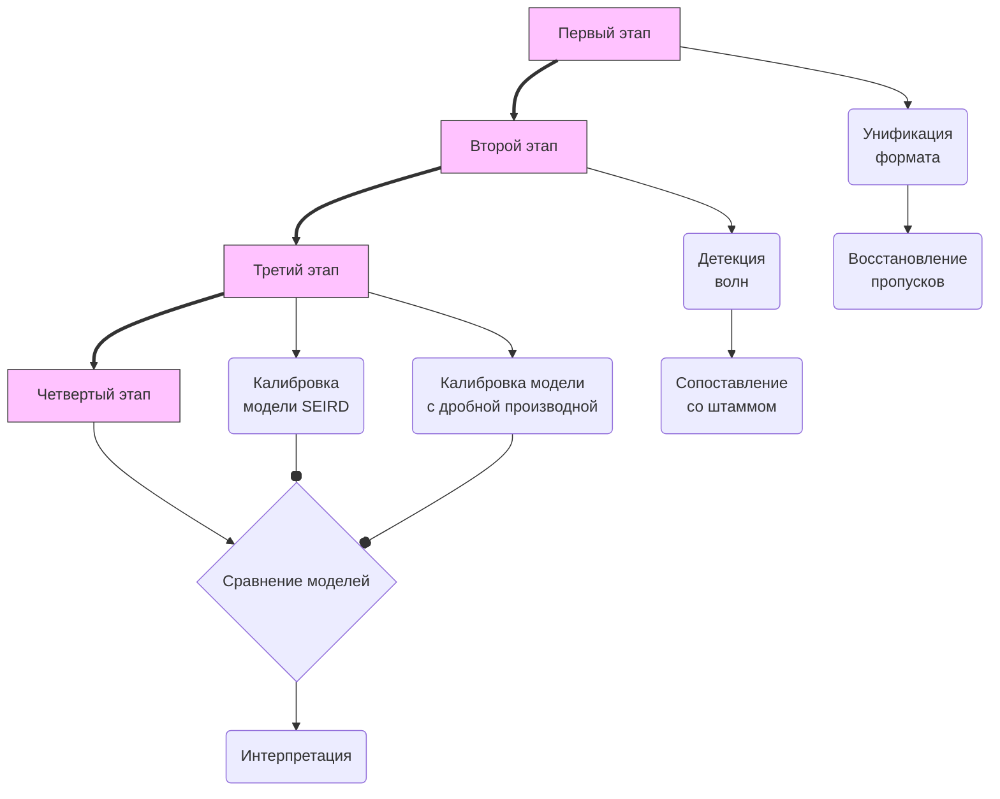

### 2.1 Общая схема исследования и характеристика объекта наблюдения

#### 2.1.1 Дизайн исследования

Настоящая работа выполнена в формате **ретроспективного описательного**
**исследования с элементами математического моделирования**. Временной
горизонт охватывает **период с 1 января 2020 года по 31 декабря**
**2025 года** — от регистрации первых случаев COVID-19 в России до
завершения активной фазы пандемии на субнациональном уровне. Единицей
наблюдения является один день; единицей анализа — отдельная
эпидемическая волна, идентифицированная алгоритмически из непрерывного
ряда ежедневной заболеваемости.

Исследование реализовано в виде **последовательного аналитического**
**конвейера**, включающего четыре функционально обособленных этапа
(рисунок 1). На **первом этапе** исходные данные государственного
эпидемиологического надзора приводятся к единому формату, проходят
контроль качества и восстановление пропусков. На **втором этапе**
непрерывный ежедневный ряд разбивается на волны заболеваемости, каждая
из которых сопоставляется с доминирующим вариантом SARS-CoV-2.
На **третьем этапе** для каждой волны калибруются две конкурирующие
математические модели: стандартная SEIRD с производными целого порядка
и дробная SEIRD с производной Капуто порядка α_k. На **четвёртом
этапе** модели формально сравниваются с применением информационных
критериев и теста отношения правдоподобия, а подобранные значения α_k
интерпретируются в иммунологическом контексте соответствующих волн.

Конвейер реализован **на языке Julia** 1.x [13] с использованием пакетов
DataFrames.jl, CSV.jl, DifferentialEquations.jl [12] и Optim.jl.
Воспроизводимость вычислительной среды обеспечивается фиксацией
версий зависимостей в файле Manifest.toml. Исходный код, конфигурационные
файлы и агрегированные результаты размещены в открытом репозитории
(ссылка будет добавлена после слепого рецензирования).

---

#### 2.1.2 Район исследования

Объектом наблюдения служит население г. Пскова — административного
центра Псковской области, расположенного на северо-западе Российской
Федерации (координаты: 57°49′ с.ш., 28°20′ в.д.). По данным переписи
2021 года численность постоянного населения города составляет 202 879
человек, что относит его к категории малых и средних городов России
(100–250 тыс. жителей). Медианный возраст населения — 42,3 года;
доля лиц старше 60 лет — 26,1%, что несколько выше среднероссийского
показателя и обусловлено характерной для городов данного типа
возрастной структурой с отрицательным миграционным сальдо молодёжи.

С точки зрения типичности Псков представляет собой репрезентативный
пример малого регионального центра северо-западного пояса России:
умеренный климат с выраженной зимней сезонностью, средняя плотность
населения (~1 800 чел./км² в городской черте), ограниченный промышленный
сектор с преобладанием занятости в бюджетной сфере, торговле и
транспорте. Близость к государственной границе Российской Федерации
(~50 км до границы с Эстонией) и исторически высокая доля транзитного
трафика обусловливают повышенную по сравнению со средними городами
России интенсивность внешних миграционных потоков, что могло влиять
на сроки завоза новых вариантов вируса.

В моделировании численность восприимчивой популяции принята равной
N_city = 200 000 чел. (округлённое значение, соответствующее данным
переписи) и используется в качестве верхней границы для оптимизируемого
параметра эффективной популяции N_eff.

---

#### 2.1.3 Источники данных

Информационную основу исследования составляют два массива данных
государственного эпидемиологического надзора, предоставленных
Управлением Роспотребнадзора по Псковской области.

**Массив 1. Еженедельный мониторинг внебольничной пневмонии (ВП).**
Форма федерального государственного статистического наблюдения,
содержащая еженедельные данные о числе зарегистрированных случаев
внебольничной пневмонии в разбивке по субъектам РФ (таблица «ВП»).
Период: 2024–2025 гг. Структура файла: многоуровневые слитые заголовки
(4–5 строк), даты закодированы в именах листов, а не в ячейках данных.

**Массив 2. Оперативные сводки COVID-19.**
Ежедневные данные о заболеваемости и летальности COVID-19 в разбивке
по субъектам РФ. Период: 2020–2025 гг. Файлы содержат две структурно
различных части: до декабря 2020 года данные представлены в
поперечном (широком) формате без явного столбца даты; начиная с
декабря 2020 года — в длинном формате с явным столбцом ДАТА.
Ключевые переменные: ежедневное число новых случаев, накопленное
число случаев, ежедневное и накопленное число летальных исходов.

Оба массива изначально находились в формате Microsoft Excel (.xlsx)
с характерными для форм государственной отчётности ограничениями:
слитыми ячейками, пропусками значений вне левой верхней ячейки
объединённого диапазона, русскоязычными наименованиями столбцов
и непоследовательной схемой заголовков между периодами.

Дополнительным источником послужил авторский календарь доминирования
вариантов SARS-CoV-2, составленный на основе публикаций систем
геномного надзора и метааналитических обзоров параметров штаммов
[4, 5] применительно к российскому эпидемическому контексту.
Калибровочный файл (таблица `covid19_seird_params.csv`) содержит для
каждого варианта: идентификатор штамма, даты начала и окончания
периода доминирования (dom_start_adj, dom_end_adj), расчётные
значения σ, γ, μ, β, R₀ и производных параметров (T_incub, T_infect,
IFR, CFR).

---

#### 2.1.4 Этические аспекты и ограничения источников данных

Исследование основано исключительно на агрегированных
деперсонализированных данных государственной статистической
отчётности и не предполагает работы с персональными данными
пациентов. В соответствии с действующим законодательством Российской
Федерации прохождение этической экспертизы для данного типа
исследований не требуется.

Принципиальным ограничением источников данных является системное
занижение регистрируемой заболеваемости, характерное для данных
рутинного надзора: регистрируются только случаи, подтверждённые
лабораторно или клинически при обращении за медицинской помощью.
По имеющимся оценкам для России [17], реальная заболеваемость
превышала регистрируемую в 5–10 раз в различные периоды пандемии,
причём коэффициент занижения существенно варьировал между волнами
в зависимости от доступности тестирования и тяжести течения
доминирующего варианта. Следует отметить, что занижение связано не с особенностями организации учета в Российской Федерации, а системное различие между количеством заболевших и числом манифестированных случаев, что отражает и социальный фактор (обращаемость населения в связи с наличием подозрительных симптомов, доступности диагностических тестов и т.п.). 

Это обстоятельство непосредственно
влияет на интерпретацию параметра N_eff: подобранные значения
отражают не всю восприимчивую популяцию города, а лишь ту её
долю, которая была вовлечена в регистрируемую часть эпидемического
процесса. Данное ограничение учтено при обсуждении результатов
(раздел 4).

---

**Дополнительный источник (к разделу 2.1)**

17. Kobak D. Excess mortality reveals COVID's true toll in Russia //
    Significance. — 2021. — Vol. 18, № 2. — P. 16–19. —
    DOI: [10.1111/1740-9713.01486](https://doi.org/10.1111/1740-9713.01486).