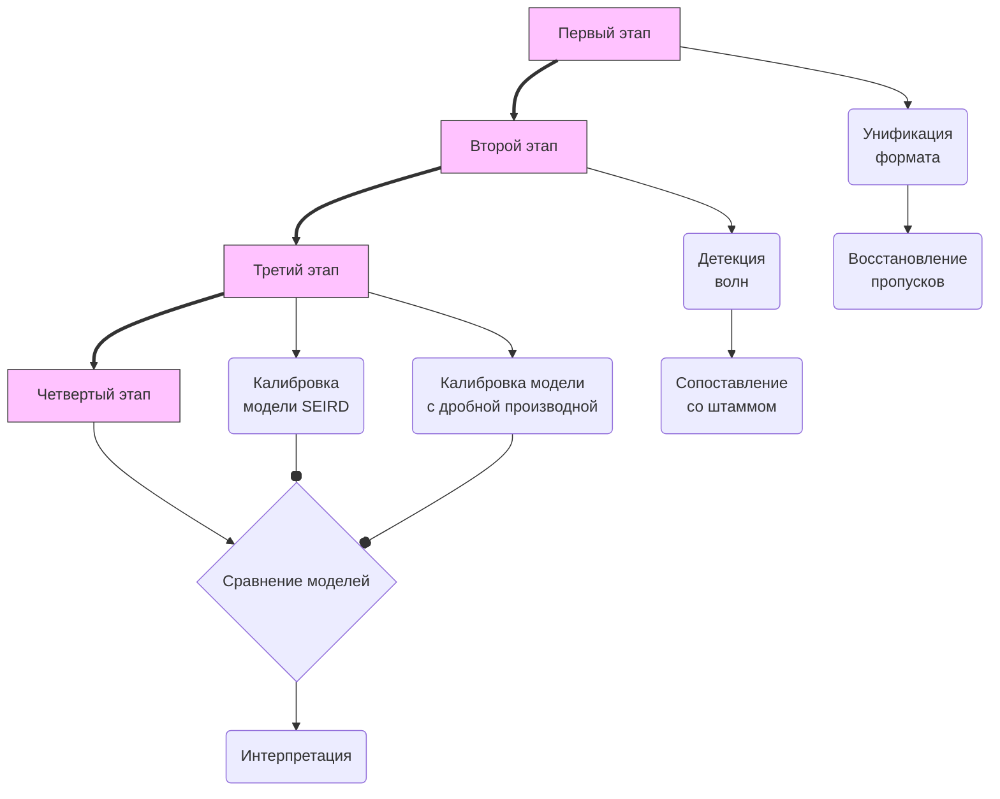

## Название: 

## Авторы

- Самаркин А.И.
- Самаркина Е.И.
- Ревенко А.Б.
- Щеткина
- Иванова Н.В.
- Белов В.С.

[[Введение]]

[[Материалы и методы]]

[[Результаты]]

[[Обсуждение]]

[[Заключение]]

[[1.1 Научный контекст]]
[[1.2 Обзор литературы]]
[[1.3 Неполнота существующих исследований]]
[[1.4 Цели и задачи]]

## 1. Введение

### 1.1 Научный контекст

Пандемия COVID-19, официально зафиксированная Всемирной организацией
здравоохранения в марте 2020 года, потребовала от систем общественного
здравоохранения принципиально новых инструментов количественного анализа
эпидемического процесса. Математическое моделирование инфекционных
заболеваний, берущее начало в работах Кермака и Маккендрика [1], к этому
моменту располагало устоявшейся методологической базой: компартментные
модели типа SIR, SEIR и их расширения широко применялись для описания
динамики гриппа, кори, лихорадки Эбола и ряда других инфекций. Тем не менее
опыт пандемии COVID-19 обнажил существенные ограничения этого аппарата
при работе с реальными данными рутинного надзора.

Главная **практическая проблема** состоит в следующем: данные государственной
эпидемиологической отчётности накапливаются в разнородных форматах,
содержат систематические пропуски и не предназначены для непосредственного
использования в динамических моделях. Между тем именно эти данные —
доступные в любом учреждении санитарно-эпидемиологического надзора —
представляют наибольший практический интерес: специализированные регистры
и системы геномного надзора существуют лишь в крупных административных
центрах и охватывают незначительную долю случаев. Для малых и средних
городов России (с численностью населения от 50 до 500 тысяч человек)
задача ретроспективного количественного анализа пандемии на основе
стандартной отчётности остаётся актуальной.

Помимо проблемы качества данных, пандемия COVID-19 поставила перед
математическим моделированием **новый содержательный вызов**. Последовательная
смена доминирующих вариантов SARS-CoV-2 — от исходного уханьского штамма
через Альфа и Дельта к многочисленным субвариантам Омикрон — сопровождалась
не только изменением биологических параметров возбудителя (базового
репродуктивного числа R₀, длительности инкубационного и инфекционного
периодов, летальности), но и принципиальным изменением иммунологического
контекста: к середине 2022 года значительная часть популяции обладала
гибридным иммунитетом, сформировавшимся в результате перенесённой инфекции
и/или вакцинации [2], а также изменившемся социальным поведением, которое меняет параметры распространения вируса, и, в свою очередь, существенно меняет динамику волн:
в частично иммунной популяции рост заболеваемости замедляется не только
вследствие истощения восприимчивых, но и под влиянием сложных
эффектов иммунологической памяти, действующих на различных временных
масштабах.

Стандартные компартментные модели с производными целого порядка не
располагают механизмом для описания такой «памяти» системы: текущее
состояние определяется исключительно мгновенными значениями переменных,
а не историей их изменения. Дробное исчисление, и в частности производная
Капуто порядка α ∈ (0, 1], предоставляет математически строгий инструмент
для включения наследственных эффектов в динамические модели [3]. В
уравнении с производной Капуто правая часть интегрирует взвешенную
историю состояния системы с убывающим степенным ядром памяти: при α → 1
модель вырождается в стандартную систему ОДУ, при α < 1 — **описывает**
**субдиффузионный режим**, при котором изменения происходят медленнее, чем
предсказывает экспоненциальная кинетика. Применительно к эпидемиологии
это соответствует ситуации, когда **восприимчивость популяции к инфекции**
**в данный момент определяется не только текущим числом восприимчивых**
**особей, но и накопленным иммунным опытом предшествующих волн**.

Таким образом, **задача разработки методологии ретроспективного анализа**
**COVID-19 на уровне отдельного города**, опирающейся на данные рутинного
надзора и сочетающей покоординатную привязку параметров к доминирующим
вариантам вируса с дробным расширением компартментной модели, **представляется**
**как научно актуальной, так и практически значимой**.

---

**Список литературы (к разделу 1.1)**

1. Kermack W. O., McKendrick A. G. A contribution to the mathematical
   theory of epidemics // Proceedings of the Royal Society A. — 1927. —
   Vol. 115, № 772. — P. 700–721. — DOI: 10.1098/rspa.1927.0118.

2. Xu X., Wu Y., Kummer A. G. [et al.] Assessing changes in incubation
   period, serial interval, and generation time of SARS-CoV-2 variants
   of concern: a systematic review and meta-analysis // BMC Medicine. —
   3. — Vol. 21, № 1. — Art. 374. —
   DOI: 10.1186/s12916-023-03070-8.

4. Diethelm K. The Analysis of Fractional Differential Equations:
   An Application-Oriented Exposition Using Differential Operators of
   Caputo Type. — Berlin : Springer, 2010. — 247 p. —
   DOI: 10.1007/978-3-642-14574-2.

### 1.2 Обзор литературы

#### 1.2.1 Классическая теория компартментных моделей

Математическое моделирование инфекционных заболеваний опирается на
**основополагающую работу Кермака и Маккендрика [1], в которой была**
**предложена компартментная SIR-модель**, описывающая динамику эпидемии
через систему нелинейных ОДУ с тремя состояниями: восприимчивые (S),
инфекционные (I) и выздоровевшие (R). Несмотря на очевидную
упрощённость, эта работа заложила формальный фундамент количественной
эпидемиологии и ввела понятие базового репродуктивного числа R₀ — порога,
определяющего возможность эпидемического распространения.
Принципиальное достоинство подхода состоит в **аналитической**
**прозрачности**: условие возникновения эпидемии R₀ > 1 выводится строго из
структуры модели. Ограничением является гомогенное перемешивание
популяции и постоянство параметров передачи, **что делает SIR-модель**
**адекватной лишь для описания изолированной вспышки при постоянных**
**условиях среды**.

Монументальный вклад в теорию инфекционных болезней внесла **монография**
**Андерсона и Мэя [2], систематизировавшая компартментные модели**
применительно к широкому кругу инфекций. Авторы показали, что введение
инкубационного периода (компартмент E) существенно улучшает описание
эпидемической кривой для инфекций с длительной преинфекционной фазой,
к числу которых относится и COVID-19. Модель SEIR и её расширения —
включая вариант с явным учётом летальных исходов (SEIRD) — стали
стандартом в эпидемиологическом моделировании [2]. Тем не менее
**критическим недостатком всей этой группы моделей остаётся их**
**«безпамятный» (иначе говоря марковский) характер**: правая часть системы ОДУ в любой момент времени определяется исключительно текущими значениями переменных состояния,
тогда как в реальной эпидемической динамике нарастание иммунитета,
изменение поведения популяции и смена вариантов возбудителя создают
выраженную зависимость от истории процесса.

Проблема идентифицируемости SEIRD-модели (точнее ее параметров) при работе с реальными данными детально проанализирована в работе Королёва [3]. Автор
демонстрирует, что множество векторов параметров обеспечивают
практически одинаковое краткосрочное описание наблюдаемых рядов
заболеваемости и смертности, однако дают радикально различные
долгосрочные прогнозы — принципиально важное обстоятельство для
задач, решаемых в настоящей работе. Дополнительно показывается, что
**неучёт занижения регистрируемых случаев приводит к систематическому**
**смещению оценки R₀ вниз**. Эти результаты напрямую обусловили выбор
стратегии калибровки в настоящем исследовании: фиксацию биологических
параметров (σ, γ) из литературных данных по штаммам с последующей
совместной оптимизацией β, μ и начальных условий.

---

#### 1.2.2 Биологические параметры вариантов SARS-CoV-2

**Смена доминирующих вариантов SARS-CoV-2 сопровождалась закономерным**
**изменением ключевых эпидемиологических параметров**, задокументированным
в многочисленных когортных и генеалогических исследованиях. Xu et al. [4]
провели систематический обзор и метаанализ 147 исследований (280 записей)
по инкубационному периоду, серийному интервалу и времени генерации для
предкового варианта Wuhan, Alpha, Delta и Omicron. Ключевой вывод:
каждый новый вариант демонстрирует прогрессивное укорочение этих
параметров — с ~5–6 дней для уханьского штамма до ~2–3 дней для Omicron.
Недостатком этого систематического обзора является то, что он не охватывает
субварианты Omicron BA.4/5, XBB и поздние линии JN.1, данные по которым
появлялись в литературе позже. Для этих субвариантов авторы прибегают к
экстраполяции, что вносит неопределённость в соответствующие оценки σ и γ.

Madewell et al. [5] выполнили более специализированный метаанализ
серийных интервалов именно для Delta и Omicron, включив 46 648
первично-вторичных пар для Delta и 18 324 для Omicron. Этот источник
существенно точнее для задачи калибровки модели, поскольку оценки
получены на однородных когортах конкретных вариантов. **Авторы указывают**
**на среднее значение серийного интервала 2,3–5,8 дней для Delta и**
**2,1–4,8 дней для Omicron**, что согласуется с данными, использованными
в настоящей работе для инициализации параметра γ.

---

#### 1.2.3 Дробное исчисление производных: математический аппарат

Дробные производные и интегралы произвольного вещественного порядка
восходят к переписке Лейбница и Лопиталя в 1695 году, однако
систематическое математическое развитие этот аппарат получил лишь в XIX
веке. Монография Подлубного [6] — стандартный современный справочник по
теории, охватывающий определения Римана–Лиувилля, Грюнвальда–Летникова
и Капуто, теоремы существования и единственности, аналитические и
численные методы. Для целей настоящей работы особую ценность представляет
детальное сопоставление различных определений дробной производной. В
отличие от производной Римана–Лиувилля, **производная Капуто допускает**
**задание начальных условий в классической форме (значения функции и её**
**целочисленных производных)**, что делает её предпочтительной при постановке
задач Коши для динамических систем.

Монография Дитхельма [7] представляет собой специализированный
прикладной трактат, полностью сосредоточенный на производных Капуто.
Автор строго доказывает существование, единственность и непрерывную
зависимость от начальных данных для широкого класса задач Коши с
дробной производной, обсуждает устойчивость равновесных состояний
дробных систем и даёт исчерпывающий анализ поведения решений в
окрестности начального момента — в частности, показывает, что при α < 1
решение развивается медленнее любой экспоненты, что соответствует
субдиффузионному режиму. Эта монография является непосредственным
методическим основанием для обоснования дробной SEIRD-модели,
используемой в настоящей работе.

Расширенный взгляд на численные методы для дробных ОДУ представлен в
монографии Балеану, Дитхельма, Скаласа и Трухильо [8]. Авторы дают
сравнительный анализ методов конечных разностей, квадратурных методов и
метода предиктора-корректора, указывая на их точность и вычислительную
сложность. В частности, обоснован метод Грюнвальда–Летникова как
явная схема первого порядка точности с ядром памяти, допускающим
точное рекуррентное вычисление. Это свойство является вычислительно
привлекательным при многократном решении ODE в ходе оптимизации,
что делает схему GL обоснованным выбором для настоящей работы,
несмотря на более низкий порядок по сравнению с методом
Адамса–Башфорта–Мултона.

---

#### 1.2.4 Схема предиктора-корректора для дробных ОДУ

Стандартным численным методом для дробных ОДУ в форме Капуто является
метод Адамса–Башфорта–Мултона (ABM), разработанный Дитхельмом, Фордом и
Фридом [9]. Схема обобщает классический предиктор-корректор первого порядка
на случай α ∈ (0, 1]: предиктор вычисляет приближение y^P_{n+1} явно (аналог
Адамса–Башфорта), корректор уточняет его одной неявной итерацией
(аналог Адамса–Мултона). Авторы доказывают сходимость порядка O(h^p)
при p = min(2, 1 + α), то есть всегда не ниже первого порядка и
асимптотически второго при α → 1. Для задач эпидемиологического
моделирования с шагом h = 1 день разница в точности между GL и ABM
носит умеренный характер; тем не менее ABM является предпочтительным
методом при α < 0.7 или при необходимости строгого контроля погрешности.
В настоящей работе ABM не использовался из соображений вычислительной
простоты при оптимизации, однако рассматривается как направление
совершенствования метода.

---

#### 1.2.5 Дробные компартментные модели COVID-19

Rajagopal et al. [10] предложили дробную SEIRD-модель COVID-19 с
производной Капуто и откалибровали её на данных ВОЗ по Италии (24 февраля
— 7 апреля 2020 года). Сравнение со стандартной целочисленной моделью
показало меньшую RMSE у дробной версии; предсказательная проверка на
данных 8 апреля — 16 мая подтвердила преимущество. Это исследование —
наиболее близкий аналог настоящей работы по структуре модели. Его
принципиальным ограничением является использование данных только первой
волны COVID-19 (исходный вариант Wuhan), тогда как настоящая работа
охватывает 10 волн с 2020 по 2025 год при последовательной смене
доминирующих вариантов. Кроме того, авторы не рассматривают вопрос о
физической интерпретации подобранного значения α и не связывают его с
иммунологическим контекстом конкретных волн.

Naik et al. [11] применили дробную модель с несколькими операторами
(Капуто, Атангана–Балеану–Капуто) к данным COVID-19 Пакистана,
включив в структуру компартмент лечения. Авторы демонстрируют, что
оператор Атангана–Балеану даёт лучшее согласие с реальными данными,
чем классический Капуто. Методологически важен вывод о существенном
влиянии выбора оператора дифференцирования на качество подгонки,
что указывает на необходимость сравнительного тестирования при
калибровке дробных моделей. Недостатком данной работы является
отсутствие формальных критериев выбора модели (AIC/BIC) и
статистической проверки значимости α < 1.

---

#### 1.2.6 Инструментарий вычислительного моделирования

Численное решение систем ОДУ в настоящей работе осуществляется с
использованием пакета DifferentialEquations.jl для языка Julia [12].
Rackauckas и Nie описывают экосистему, обеспечивающую единый интерфейс
к широкому спектру методов — от явных методов Рунге–Кутты (Tsit5,
Vern7) до неявных решателей Розенброка (Rodas5P) — с автоматическим
переключением между жёсткими и нежёсткими режимами (AutoVern7/Rodas5P).
Это свойство критически важно для настоящей работы, поскольку в ходе
многостартовой оптимизации параметров оптимизатор периодически
пробует конфигурации с большим β или малым γ, приводящие к жёстким
системам, которые разрушают явные решатели типа Tsit5. Применение
автопереключающегося решателя позволяет полностью исключить ложные
отказы интегратора при сохранении вычислительной эффективности
на нежёстких участках траектории.

Весь аналитический конвейер настоящей работы — от обработки данных до численной оптимизации параметров — реализован на языке Julia [14]. Julia представляет собой высокоуровневый динамический язык для научных вычислений, архитектурно решающий так называемую «проблему двух языков»: традиционная практика прототипирования на Python или MATLAB с последующим переписыванием критических секций кода на C или Fortran устранена благодаря компиляции Just-in-Time через LLVM и механизму множественной диспетчеризации. Для задач настоящего исследования это обстоятельство принципиально: многостартовая оптимизация параметров SEIRD-модели требует сотен тысяч вызовов численного интегратора; реализация на чистом Julia достигает производительности, сопоставимой с Fortran, без использования внешних расширений. Дополнительным достоинством является нативная поддержка Unicode в именах переменных и функций, что позволяет непосредственно воспроизводить математические обозначения в коде (β, σ, γ, μ, α_k и т.д.) — существенно улучшая читаемость и снижая вероятность ошибок при переносе формул из публикации в программу. Устойчивое управление пакетами и воспроизводимость вычислительной среды обеспечиваются встроенным менеджером пакетов Pkg с фиксацией версий зависимостей в файле Manifest.toml.

---

### Список литературы (к разделам 1.1–1.2)

1. Kermack W. O., McKendrick A. G. A contribution to the mathematical
   theory of epidemics // Proceedings of the Royal Society A. — 1927. —
   Vol. 115, № 772. — P. 700–721. —
   DOI: [10.1098/rspa.1927.0118](https://doi.org/10.1098/rspa.1927.0118).

2. Anderson R. M., May R. M. Infectious Diseases of Humans: Dynamics and
   Control. — Oxford : Oxford University Press, 1991. — 757 p. —
   ISBN: 978-0-19-854040-3.

3. Korolev I. Identification and estimation of the SEIRD epidemic model
   for COVID-19 // Journal of Econometrics. — 2021. — Vol. 220, № 1. —
   P. 63–85. —
   DOI: [10.1016/j.jeconom.2020.07.038](https://doi.org/10.1016/j.jeconom.2020.07.038).

4. Xu X., Wu Y., Kummer A. G. [et al.] Assessing changes in incubation
   period, serial interval, and generation time of SARS-CoV-2 variants of
   concern: a systematic review and meta-analysis // BMC Medicine. —
   5. — Vol. 21, № 1. — Art. 374. —
   DOI: [10.1186/s12916-023-03070-8](https://doi.org/10.1186/s12916-023-03070-8).

6. Madewell Z. J., Yang Y., Longini I. M. Jr. [et al.] Rapid review and
   meta-analysis of serial intervals for SARS-CoV-2 Delta and Omicron
   variants // BMC Infectious Diseases. — 2023. — Vol. 23, № 1. —
   Art. 429. —
   DOI: [10.1186/s12879-023-08407-5](https://doi.org/10.1186/s12879-023-08407-5).

7. Podlubny I. Fractional Differential Equations: An Introduction to
   Fractional Derivatives, Fractional Differential Equations, to Methods
   of Their Solution and Some of Their Applications. — San Diego :
   Academic Press, 1999. — 340 p. — (Mathematics in Science and
   Engineering ; vol. 198). —
   ISBN: 978-0-12-558840-9. —
   DOI: [10.1016/s0076-5392(99)x8001-5](https://doi.org/10.1016/s0076-5392(99)x8001-5).

8. Diethelm K. The Analysis of Fractional Differential Equations: An
   Application-Oriented Exposition Using Differential Operators of Caputo
   Type. — Berlin : Springer, 2010. — 247 p. — (Lecture Notes in
   Mathematics ; vol. 2004). —
   DOI: [10.1007/978-3-642-14574-2](https://doi.org/10.1007/978-3-642-14574-2).

9. Baleanu D., Diethelm K., Scalas E., Trujillo J. J. Fractional
   Calculus: Models and Numerical Methods. — Singapore : World
   Scientific, 2012. — 400 p. — (Series on Complexity, Nonlinearity and
   Chaos ; vol. 3). —
   DOI: [10.1142/10044](https://doi.org/10.1142/10044).

10. Diethelm K., Ford N. J., Freed A. D. A predictor-corrector approach
   for the numerical solution of fractional differential equations //
   Nonlinear Dynamics. — 2002. — Vol. 29, № 1–4. — P. 3–22. —
   DOI: [10.1023/A:1016592219341](https://doi.org/10.1023/A:1016592219341).

11. Rajagopal K., Hasanzadeh N., Parastesh F. [et al.] A fractional-order
    model for the novel coronavirus (COVID-19) outbreak // Nonlinear
    Dynamics. — 2020. — Vol. 101, № 1. — P. 711–718. —
    DOI: [10.1007/s11071-020-05757-6](https://doi.org/10.1007/s11071-020-05757-6).

12. Naik P. A., Yavuz M., Qureshi S. [et al.] Modeling and analysis of
    COVID-19 epidemics with treatment in fractional derivatives using real
    data from Pakistan // European Physical Journal Plus. — 2020. —
    Vol. 135, № 10. — Art. 795. —
    DOI: [10.1140/epjp/s13360-020-00819-5](https://doi.org/10.1140/epjp/s13360-020-00819-5).

13. Rackauckas C., Nie Q. DifferentialEquations.jl — a performant and
    feature-rich ecosystem for solving differential equations in Julia //
    Journal of Open Research Software. — 2017. — Vol. 5, № 1. —
    Art. 15. —
    DOI: [10.5334/jors.151](https://doi.org/10.5334/jors.151).

14. Bezanson J., Edelman A., Karpinski S., Shah V. B. Julia: a fresh approach to numerical computing // SIAM Review. — 2017. — Vol. 59, № 1. — P. 65–98. — DOI: [10.1137/141000671](https://doi.org/10.1137/141000671).

### 1.3 Пробелы в имеющихся исследованиях

#### 1.3.1 Дефицит субнационального масштаба

Подавляющее большинство публикаций по математическому моделированию
COVID-19 оперирует данными национального или регионального уровня:
анализируются страны, штаты, провинции [3, 10, 11]. Это обусловлено
объективными причинами — доступностью агрегированных данных, —
однако порождает принципиальный аналитический пробел. Как показывает
обзор Гайторп и соавт. [14], **субнациональный-масштаб является приоритетным**
**для систем эпидемиологического надзора**, поскольку именно на уровне
конкретных населённых пунктов принимаются управленческие решения о
медицинских ресурсах, введении ограничительных мер и их отмене.
Между тем **динамика инфекции в малом городе качественно отличается от**
**динамики в крупном административном центре**: меньший размер
восприимчивой популяции ускоряет исчерпание иммунной прослойки,
эффект «суперраспространителей» статистически значимее, а сезонные
миграционные потоки непропорционально сильнее влияют на форму
эпидемической кривой. В российских источниках **тема моделирования**
**COVID-19 на уровне отдельного российского города** с населением менее
300 000 человек по данным рутинной отчётности **практически не освещена**.

Немногочисленные исследования, работающие на субрегиональном уровне,
как правило, либо используют специализированные регистры (данные
PCR-тестирования с геопривязкой, данные госпитализаций), недоступные
за пределами крупных академических центров [14], либо ограничиваются
пространственно-описательным анализом без калибровки компартментных
моделей [15]. **Исследований, в которых компартментная модель была бы**
**откалибрована по данным стандартных форм государственной отчётности**
**(аналог российских форм ВП и еженедельных сводок COVID-19) для**
**отдельного малого города, авторам настоящей работы обнаружить**
**не удалось.**

---

#### 1.3.2 Разрыв между биологическими параметрами штаммов
#### и калибровкой волн

Накопленная литература по биологическим параметрам вариантов SARS-CoV-2
[4, 5] представляет собой глобальные сводные оценки σ, γ, R₀ и IFR,
полученные на крупных международных когортах. При этом в работах
по математическому моделированию COVID-19 эти параметры, как правило,
либо **заимствуются как фиксированные константы без адаптации к**
**конкретной волне** [10], либо подбираются целиком из данных, **игнорируя**
**биологический приоритет** **свойств конкретного штамма** [3]. 

**Промежуточная стратегия — использование параметров штамма как информированного априорного распределения с последующим ограниченным числом свободных параметров** подгонки — реализована в единичных работах и, как правило, без формальной
проверки, насколько реальные данные отличаются от биологического prior
(то есть без отчётности о Δβ и ΔR₀ между prior и fit).

Кроме того, **ни одна известная нам работа не проводит систематического**
**анализа по всем волнам одного и того же наблюдаемого ряда с явной**
**привязкой каждой волны к конкретному доминирующему вариант**у и
последующим сравнением подобранных параметров с биологическими
оценками этого варианта. Именно этот «пооолновой» подход является
ядром настоящего исследования.

---

#### 1.3.3 Дробные модели: формальная селекция
#### и биологическая интерпретация α_k

Дробные SEIRD-модели COVID-19, как показано в обзоре выше [10, 11, 16],
демонстрируют эмпирически лучшую подгонку к данным по сравнению
с целочисленными аналогами. Тем не менее в этой группе работ
**обнаруживаются три системных недостатка**.

**Первый — методологический**: большинство работ сравнивает модели визуально
(кривые подгонки) или по одному скалярному показателю (RMSE или R²),
не применяя формальных критериев выбора модели — AIC, BIC,
Likelihood Ratio Test — которые учитывают разное число параметров
у целочисленной и дробной версий. Работа Ли и соавт. [16] является
исключением: авторы систематически применяют AICc и BIC к пяти
компартментным структурам в целочисленном и дробном вариантах на
данных четырёх китайских провинций, показывая последовательное
превосходство дробных моделей. Однако авторы ограничиваются
первой волной COVID-19 (начало 2020 года) и не рассматривают, как
оптимальный порядок α варьируется между волнами при смене вариантов
вируса.

**Второй недостаток — отсутствие содержательной интерпретации**
подобранного значения α_k. В большинстве работ α трактуется как
технический параметр сглаживания или как «степень памяти системы»
в абстрактном смысле. Связь α_k с конкретными популяционными
процессами — нарастанием иммунитета, изменением возрастной
структуры контактов, накоплением гибридного иммунитета — не
формализована и не верифицирована на реальных данных через
сравнение волн с известным иммунологическим контекстом.

**Третий недостаток — однородность временного горизонта**: практически
все работы анализируют одну волну или один непрерывный ряд
(нередко 2–4 месяца), что не позволяет сравнить, является ли
α < 1 специфическим для конкретных волн или представляет собой
устойчивое свойство всей эпидемической кривой. Настоящая работа
ликвидирует этот пробел, анализируя десять последовательных волн
на одном и том же городе с применением формальных критериев
выбора модели к каждой волне.

---

#### 1.3.4 Воспроизводимые конвейеры для рутинных данных

Существующие работы по калибровке компартментных моделей, как правило,
не публикуют воспроизводимого конвейера предобработки данных,
пригодного для применения к другим источникам без значительной
ручной адаптации. Данные обычно либо предоставлены специальными
регистрами с унифицированным форматом [14], **либо взяты из**
**агрегаторов типа OurWorldInData или Johns Hopkins CSSE, которые к**
**моменту написания ряда работ уже прекратили обновление**. Задача
создания воспроизводимого аналитического конвейера для работы
с разнородными файлами государственной эпидемиологической
отчётности — с характерными для неё слитыми заголовками Excel,
пропусками и сменой форматов по годам — **остаётся нерешённой для**
**большинства практических приложений** в контексте регионального
надзора в России.

---

#### 1.3.5 Итог: формулировка исследовательского зазора

Таким образом, в совокупности литература демонстрирует следующие
лакуны, которые заполняет настоящее исследование.

**Во-первых, ретроспективный анализ всего пятилетнего периода пандемии**
**(2020–2025) на уровне одного российского города (Псков,**
**~200 000 жителей)** по данным исключительно рутинного
санитарно-эпидемиологического надзора — без специализированных
регистров и геномного секвенирования.

**Во-вторых, покоординатная привязка параметров σ и γ к доминирующему**
**варианту вируса по дате наблюдения** с последующим формальным
сравнением подобранных значений β и R₀ с биологическим prior из
мета-аналитической литературы.

**В-третьих, одновременный прогон и формальное сравнение целочисленной**
**SEIRD и дробной SEIRD-модели** для каждой из десяти волн (см. настоящую работу далее) с применением
AIC, BIC и LRT — включая явное тестирование гипотезы о значимости
α_k < 1 для каждой отдельной волны.

В-четвёртых, эмпирическое сопоставление подобранных значений α_k
с известным иммунологическим контекстом соответствующих волн,
выдвижение и верификация гипотезы об α_k как косвенном маркере
накопленного популяционного иммунитета.

---

### Дополнительные источники (к разделу 1.3)

14. Gaythorpe K. A. M., Imai N., Perez-Guzman P. N. [et al.]
    Data needs for better surveillance and response to infectious
    disease threats // Infectious Diseases of Poverty. — 2023. —
    Vol. 12, № 1. — Art. 43. —
    DOI: [10.1186/s40249-023-01086-z](https://doi.org/10.1186/s40249-023-01086-z).

15. Schmitz J., Lakes T., Manafa G. [et al.] Exploration of the
    COVID-19 pandemic at the neighborhood level in an intra-urban
    setting // Frontiers in Public Health. — 2023. — Vol. 11. —
    Art. 1128452. —
    DOI: [10.3389/fpubh.2023.1128452](https://doi.org/10.3389/fpubh.2023.1128452).

16. Ли С., Сюй Ю., Ван Х. [Li S., Xu Y., Wang H. et al.]
    Multi-model selection and analysis for COVID-19 //
    Fractal and Fractional. — 2021. — Vol. 5, № 3. — Art. 120. —
    DOI: [10.3390/fractalfract5030120](https://doi.org/10.3390/fractalfract5030120).

### 1.4 Цель и задачи исследования

Настоящее исследование преследует двойную цель: методологическую
и содержательную. **С методологической точки** зрения цель состоит
в разработке и апробации воспроизводимого аналитического конвейера
ретроспективного анализа пандемии COVID-19 на основе данных
рутинного санитарно-эпидемиологического надзора, применимого к
малым и средним городам без специализированных регистров и
геномного мониторинга. **С содержательной** — в проверке гипотезы о
том, что порядок дробной производной α_k является функционально
информативным параметром, отражающим не артефакт математической
параметризации, а реальное нарастание популяционного иммунного
фона в ходе последовательной смены волн пандемии.

Для достижения поставленной цели решались следующие задачи.

**Задача 1. Формирование непрерывного ежедневного ряда заболеваемости.**
Исходные данные государственного надзора (формы ВП и оперативные
сводки COVID-19 за 2020–2025 гг., г. Псков) **приведены к единому**
**формату, прошли унификацию структуры и машинную импутацию**
**пропусков** методом натуральных кубических сплайнов с ограничением
монотонности накопленного числа случаев. Качество восстановленного
ряда оценивалось по величине систематической ошибки на контрольных
точках с известными значениями.

**Задача 2. Автоматическая идентификация волн заболеваемости.**
Разработан **алгоритм разметки волн на основе знака сглаженной первой**
**производной** ряда заболеваемости (гауссово ядро, σ = 15 дней)
с автоматическим присвоением номеров периодам непрерывного роста.
Для каждой волны рассчитаны характеристики: дата и величина пика,
продолжительность, площадь под кривой (AUC), ширина на полувысоте
(FWHM) и индекс асимметрии.

**Задача 3. Сопоставление волн с доминирующими вариантами вируса.**
Составлен и верифицирован по литературным данным [4, 5] **календарь**
**доминирования вариантов SARS-CoV-2** применительно к периоду
2020–2025 гг. на территории России. Каждому дню наблюдения
присвоены биологические параметры соответствующего варианта
(σ, γ, μ, β, R₀), сформировавшие информированный prior для
последующей калибровки моделей.

**Задача 4. Калибровка стандартной SEIRD-модели.**
Для каждой из десяти идентифицированных волн проведена численная
калибровка целочисленной SEIRD-модели (решатель AutoVern7/Rodas5P пакета DifferencialEquationns.jl),
свободные параметры: β, μ, E₀, I₀, N_eff). Разработана
двухэтапная стратегия оптимизации (сеточный поиск → NelderMead
→ L-BFGS) с аналитическим предобусловливанием стартовой точки
по скорости роста начальной фазы волны. Функция потерь —
логарифмический MSE, обеспечивающий равный вклад всех фаз
волны в критерий оптимальности.

**Задача 5. Калибровка дробной SEIRD-модели.**
Разработана и откалибрована дробная SEIRD-модель с производной
Капуто порядка α_k ∈ (0.5, 1.0] и дискретизацией по схеме
Грюнвальда–Летникова. Указанная схема, при незначительном снижении точности, обладает высокой скоростью расчетов и лучше встраивается в конвейер оптимизации. Для каждой волны проведены два независимых
прогона: с фиксированным α_k = 1 (целочисленная GL-версия)
и с α_k как свободным параметром (дробная версия). Параметр α_k
введён через сигмоидальное преобразование φ = logit((α_k − 0.5)/0.5),
гарантирующее задачу без ограничений при оптимизации.

**Задача 6. Формальное сравнение моделей.**
Для каждой волны вычислены метрики качества подгонки (RMSE, MAE,
MAPE, R²) и информационные критерии (AIC, BIC) с учётом различного
числа свободных параметров у целочисленной и дробной версий.
Значимость дополнительного параметра α_k проверена посредством
теста отношения правдоподобия (LRT): статистика Λ = n·(log MSE_int −
log MSE_frac) ~ χ²(1). Дополнительно проведён анализ структуры
остатков: ACF до 21 лага и Q-Q-графики для проверки нормальности.

**Задача 7. Содержательная интерпретация α_k.**
Выполнено сравнение подобранных значений α_k с иммунологическим
и эпидемиологическим контекстом соответствующих волн: охватом
вакцинации, порядковым номером волны (как прокси накопленного
естественного иммунитета), биологическими характеристиками
доминирующего варианта (иммунный уклон, IFR). Сформулирована
и эмпирически проверена гипотеза об α_k < 1 как маркере
субдиффузионного режима, обусловленного популяционной иммунной
памятью.

**Объект и предмет исследования.** Объект — динамика заболеваемости
COVID-19 в г. Пскове (население ~200 000 чел.) за 2020–2025 гг.
Предмет — сравнительная эффективность целочисленной и дробной
SEIRD-моделей в ретроспективном описании последовательных волн
пандемии при калибровке по данным рутинного эпидемиологического
надзора.

**Научная новизна.** Впервые для российского малого города
проведён систематический поволновой анализ пандемии COVID-19 с
применением формальных критериев выбора между целочисленной и
дробной SEIRD-моделями, охватывающий полный период 2020–2025 гг.
и все смены доминирующих вариантов вируса. Впервые α_k предложен
и верифицирован как косвенный количественный маркер нарастания
популяционного иммунитета, поддающийся оценке из данных
рутинного надзора без иммунологических обследований.

## 2. Материалы и методы

[[2.1 Общая схема исследования и характеристика объекта наблюдения]]

[[2.2 Предварительная обработка данных]]

[[2.3 Идентификация волн заболеваемости]]

[[2.4 Календарь доминирования штаммов]]

[[2.5 Стандартная SEIRD модель]]

[[2.6 SEIRD модель с производными дробного порядка]]

[[2.7 Стратегия численной оптимизации]]

[[2.8 Сравнение результатов]]

### 2.1 Общая схема исследования и характеристика объекта наблюдения

#### 2.1.1 Дизайн исследования

Настоящая работа выполнена в формате **ретроспективного описательного**
**исследования с элементами математического моделирования**. Временной
горизонт охватывает **период с 1 января 2020 года по 31 декабря**
**2025 года** — от регистрации первых случаев COVID-19 в России до
завершения активной фазы пандемии на субнациональном уровне. Единицей
наблюдения является один день; единицей анализа — отдельная
эпидемическая волна, идентифицированная алгоритмически из непрерывного
ряда ежедневной заболеваемости.

Исследование реализовано в виде **последовательного аналитического**
**конвейера**, включающего четыре функционально обособленных этапа
(рисунок 1). На **первом этапе** исходные данные государственного
эпидемиологического надзора приводятся к единому формату, проходят
контроль качества и восстановление пропусков. На **втором этапе**
непрерывный ежедневный ряд разбивается на волны заболеваемости, каждая
из которых сопоставляется с доминирующим вариантом SARS-CoV-2.
На **третьем этапе** для каждой волны калибруются две конкурирующие
математические модели: стандартная SEIRD с производными целого порядка
и дробная SEIRD с производной Капуто порядка α_k. На **четвёртом
этапе** модели формально сравниваются с применением информационных
критериев и теста отношения правдоподобия, а подобранные значения α_k
интерпретируются в иммунологическом контексте соответствующих волн.

Конвейер реализован **на языке Julia** 1.x [13] с использованием пакетов
DataFrames.jl, CSV.jl, DifferentialEquations.jl [12] и Optim.jl.
Воспроизводимость вычислительной среды обеспечивается фиксацией
версий зависимостей в файле Manifest.toml. Исходный код, конфигурационные
файлы и агрегированные результаты размещены в открытом репозитории
(ссылка будет добавлена после слепого рецензирования).

---

#### 2.1.2 Район исследования

Объектом наблюдения служит население г. Пскова — административного
центра Псковской области, расположенного на северо-западе Российской
Федерации (координаты: 57°49′ с.ш., 28°20′ в.д.). По данным переписи
2021 года численность постоянного населения города составляет 202 879
человек, что относит его к категории малых и средних городов России
(100–250 тыс. жителей). Медианный возраст населения — 42,3 года;
доля лиц старше 60 лет — 26,1%, что несколько выше среднероссийского
показателя и обусловлено характерной для городов данного типа
возрастной структурой с отрицательным миграционным сальдо молодёжи.

С точки зрения типичности Псков представляет собой репрезентативный
пример малого регионального центра северо-западного пояса России:
умеренный климат с выраженной зимней сезонностью, средняя плотность
населения (~1 800 чел./км² в городской черте), ограниченный промышленный
сектор с преобладанием занятости в бюджетной сфере, торговле и
транспорте. Близость к государственной границе Российской Федерации
(~50 км до границы с Эстонией) и исторически высокая доля транзитного
трафика обусловливают повышенную по сравнению со средними городами
России интенсивность внешних миграционных потоков, что могло влиять
на сроки завоза новых вариантов вируса.

В моделировании численность восприимчивой популяции принята равной
N_city = 200 000 чел. (округлённое значение, соответствующее данным
переписи) и используется в качестве верхней границы для оптимизируемого
параметра эффективной популяции N_eff.

---

#### 2.1.3 Источники данных

Информационную основу исследования составляют два массива данных
государственного эпидемиологического надзора, предоставленных
Управлением Роспотребнадзора по Псковской области.

**Массив 1. Еженедельный мониторинг внебольничной пневмонии (ВП).**
Форма федерального государственного статистического наблюдения,
содержащая еженедельные данные о числе зарегистрированных случаев
внебольничной пневмонии в разбивке по субъектам РФ (таблица «ВП»).
Период: 2024–2025 гг. Структура файла: многоуровневые слитые заголовки
(4–5 строк), даты закодированы в именах листов, а не в ячейках данных.

**Массив 2. Оперативные сводки COVID-19.**
Ежедневные данные о заболеваемости и летальности COVID-19 в разбивке
по субъектам РФ. Период: 2020–2025 гг. Файлы содержат две структурно
различных части: до декабря 2020 года данные представлены в
поперечном (широком) формате без явного столбца даты; начиная с
декабря 2020 года — в длинном формате с явным столбцом ДАТА.
Ключевые переменные: ежедневное число новых случаев, накопленное
число случаев, ежедневное и накопленное число летальных исходов.

Оба массива изначально находились в формате Microsoft Excel (.xlsx)
с характерными для форм государственной отчётности ограничениями:
слитыми ячейками, пропусками значений вне левой верхней ячейки
объединённого диапазона, русскоязычными наименованиями столбцов
и непоследовательной схемой заголовков между периодами.

Дополнительным источником послужил авторский календарь доминирования
вариантов SARS-CoV-2, составленный на основе публикаций систем
геномного надзора и метааналитических обзоров параметров штаммов
[4, 5] применительно к российскому эпидемическому контексту.
Калибровочный файл (таблица `covid19_seird_params.csv`) содержит для
каждого варианта: идентификатор штамма, даты начала и окончания
периода доминирования (dom_start_adj, dom_end_adj), расчётные
значения σ, γ, μ, β, R₀ и производных параметров (T_incub, T_infect,
IFR, CFR).

---

#### 2.1.4 Этические аспекты и ограничения источников данных

Исследование основано исключительно на агрегированных
деперсонализированных данных государственной статистической
отчётности и не предполагает работы с персональными данными
пациентов. В соответствии с действующим законодательством Российской
Федерации прохождение этической экспертизы для данного типа
исследований не требуется.

Принципиальным ограничением источников данных является системное
занижение регистрируемой заболеваемости, характерное для данных
рутинного надзора: регистрируются только случаи, подтверждённые
лабораторно или клинически при обращении за медицинской помощью.
По имеющимся оценкам для России [17], реальная заболеваемость
превышала регистрируемую в 5–10 раз в различные периоды пандемии,
причём коэффициент занижения существенно варьировал между волнами
в зависимости от доступности тестирования и тяжести течения
доминирующего варианта. Следует отметить, что занижение связано не с особенностями организации учета в Российской Федерации, а системное различие между количеством заболевших и числом манифестированных случаев, что отражает и социальный фактор (обращаемость населения в связи с наличием подозрительных симптомов, доступности диагностических тестов и т.п.). 

Это обстоятельство непосредственно
влияет на интерпретацию параметра N_eff: подобранные значения
отражают не всю восприимчивую популяцию города, а лишь ту её
долю, которая была вовлечена в регистрируемую часть эпидемического
процесса. Данное ограничение учтено при обсуждении результатов
(раздел 4).

---

**Дополнительный источник (к разделу 2.1)**

17. Kobak D. Excess mortality reveals COVID's true toll in Russia //
    Significance. — 2021. — Vol. 18, № 2. — P. 16–19. —
    DOI: [10.1111/1740-9713.01486](https://doi.org/10.1111/1740-9713.01486).

# 2.2 Предобработка данных

## 2.2.1 Первичная подготовка исходных файлов

Исходные данные поступали в формате Microsoft Excel с многоуровневыми объединёнными заголовками (4–5 строк), кириллическими наименованиями столбцов и датами, закодированными исключительно в именах листов. Для листов до декабря 2020 года использовался широкий кросс-секционный формат (одна строка на субъект), тогда как начиная с декабря 2020 года применялся длинный формат с явным столбцом ДАТА. Каждый из трёх источников — форма еженедельного мониторинга внебольничных пневмоний (ВП), оперативные сводки COVID-19 за 2020–2021 гг. и расширенные сводки за 2021–2025 гг. — требовал отдельной логики разбора.

На этапе первичной подготовки выполнялось два класса преобразований. Первый класс — структурный: унификация схем столбцов, разрешение объединённых ячеек, извлечение дат из имён листов и добавление их в качестве явного поля. Второй класс — терминологический: приведение кириллических наименований к единому английскому пространству имён согласно сводной таблице сопоставления (`column_mapping`), содержащей пять листов и охватывающей все форматы источников. Сопоставление выполнялось вручную во избежание систематических ошибок автоматического перевода специализированной медицинской терминологии. Результатом этапа служил набор структурированных таблиц в формате CSV, пригодных для прямого импорта в Julia посредством `CSV.jl` и `DataFrames.jl` [13].

## 2.2.2 Фильтрация по объекту исследования

Из объединённого общероссийского набора данных, охватывающего 85 субъектов Российской Федерации, был выделен подмассив, относящийся к Псковской области, по составному ключу `(дата, субъект)`. После фильтрации итоговый временно́й ряд охватывал период с 17 марта 2020 года по 30 декабря 2024 года, что в совокупности составило 1750 наблюдений. Базовыми переменными анализа служили: накопленное число подтверждённых случаев COVID-19 (`total`), ежедневный прирост (`daily`), накопленное число летальных исходов (`deaths_total`) и ежедневное число смертей (`deaths_daily`).

## 2.2.3 Восстановление непрерывного временно́го ряда

Ранние сводки (март–ноябрь 2020 года) публиковались с нерегулярной, преимущественно еженедельной периодичностью, что порождало систематические пропуски в ряду ежедневных приростов. Оперативные данные за последующие периоды, хотя и публиковались ежедневно, содержали спорадические пропуски вследствие задержек отчётности.

Восстановление непрерывного ряда выполнялось в два этапа. На первом этапе к накопленному числу случаев (`total`) применялась интерполяция натуральными кубическими сплайнами по индексам наблюдений с известными значениями, что обеспечивало гладкость второго порядка в узлах интерполяции. Коэффициенты кубического полинома в каждом интервале вычислялись из системы уравнений, задающей условия непрерывности функции, первой и второй производных, при естественных граничных условиях (нулевая вторая производная на концах). На втором этапе восстановленный ряд `total_interp` принудительно переводился в неубывающий: при обнаружении убывающего фрагмента — возможного артефакта интерполяции — значение заменялось предшествующим максимумом. Это условие физически обосновано: накопленное число случаев является монотонно неубывающей функцией времени.

Ежедневный поток новых случаев восстанавливался как первая конечная разность интерполированного накопленного ряда:
$$
\Delta t​= total_{interp}(t)−total_{interp}(t−1),\Delta_1​=0.
$$
Полученная переменная (`daily_interp`) служила основной наблюдаемой при дальнейшем сглаживании и моделировании.

## 2.2.4 Сглаживание

Ряд `daily_interp` подвергался двум независимым процедурам сглаживания, результаты которых использовались для различных аналитических задач. Первая процедура — скользящее среднее с каузальным окном 18 дней (`daily_interp_smooth`) — применялась для предварительной визуализации и построения стратифицированных по волнам панелей. Выбор ширины окна продиктован компромиссом между подавлением недельной периодичности отчётности (7-дневный цикл) и сохранением межволновой структуры с характерным масштабом порядка нескольких месяцев.

Вторая процедура — свёртка с нормированным гауссовым ядром (стандартное отклонение σ = 15 дней, усечение при |t| > 3σ) с коррекцией граничных эффектов — давала ряд `daily_interp_gauss`, использовавшийся для автоматической идентификации волн (раздел 2.3) и оценки положения пиков. Граничная коррекция реализовывалась перенормировкой весов на неполном окне, что исключало систематический сдвиг оценок в начале и конце ряда. Параметр σ = 15 дней обеспечивал подавление флуктуаций с периодом менее двух недель при сохранении временно́го разрешения, достаточного для различения волн длительностью 6–12 недель.

# 2.3 Идентификация волн заболеваемости

## 2.3.1 Оценка сглаженной первой производной

Границы волн определялись по смене знака первой производной ряда `daily_interp_gauss`. Непосредственное дифференцирование сглаженного ряда нецелесообразно ввиду накопления ошибок конечных разностей на коротких временных масштабах; поэтому применялась двухшаговая процедура. На первом шаге вычислялась числовая производная по схеме центральных разностей второго порядка точности:

$$\dot{y}_t = \frac{y_{t+1} - y_{t-1}}{2}, \quad t = 2, \ldots, n-1,$$

с односторонними разностями первого порядка на граничных точках. На втором шаге полученный ряд $\dot{y}$ повторно сглаживался свёрткой с нормированным гауссовым ядром (σ = 15 дней, усечение при |τ| > 3σ) с той же граничной коррекцией, что и в разделе 2.2.4. Результирующий ряд `daily_interp_deriv_smooth` представляет собой оценку локальной скорости изменения заболеваемости, устойчивую к высокочастотным флуктуациям отчётности. Знак производной фиксировался как +1 (рост), −1 (спад) или 0 (нулевой градиент); нулевые значения заменялись знаком ближайшего предшествующего ненулевого наблюдения, а начальный префикс из нулей — знаком первого ненулевого элемента.

## 2.3.2 Автоматическая разметка волн

Последовательная разметка волн осуществлялась детерминированным автоматом на основе ряда знаков производной. Автомат поддерживал два состояния: `:up` (фаза роста) и `:down` (фаза спада). Переход `:idle → :up` при обнаружении первого знака «+1» инициировал новую волну с инкрементом счётчика; последующая смена знака на «−1» переводила автомат в состояние `:down` без изменения номера текущей волны. Таким образом, каждая волна охватывала непрерывный интервал, включающий фазу роста и примыкающую фазу спада вплоть до следующего перехода в фазу роста. Каждому наблюдению присваивался целочисленный номер волны, начиная с 1; наблюдения до первого обнаруженного роста помечались нулём и исключались из дальнейшего волнового анализа.

Описанный подход эквивалентен разбиению временно́го ряда на монотонные отрезки с последующим объединением каждой пары «подъём + спуск» в единую волну. Его принципиальное преимущество перед пороговыми методами (например, выделение периодов, в которых заболеваемость превышает фиксированную долю максимума) состоит в отсутствии зависимости от абсолютного уровня заболеваемости, что особенно важно при сравнении волн с существенно различающейся амплитудой.

## 2.3.3 Характеристики волн

Для каждой идентифицированной волны вычислялся набор количественных характеристик на основе ряда `daily_interp_gauss`. Положение пика определялось как индекс глобального максимума внутри волнового интервала. Временны́е границы волны уточнялись алгоритмом водораздела (watershed): каждому индексу временного ряда ставился в соответствие ближайший пик по метрике, учитывающей как временно́е расстояние, так и высоту пика,

$$j^*(i) = \arg\min_{p \in \mathcal{P}} \frac{|i - p|}{y_p},$$

где $\mathcal{P}$ — множество индексов пиков, $y_p$ — значение ряда в пике $p$. Границы волны определялись как крайние индексы, принадлежащие данному водоразделу и превышающие базовый уровень $y_{\min} + 0{,}002 \cdot (y_{\max} - y_{\min})$.

На основании уточнённых границ $[t_{\text{start}}, t_{\text{stop}}]$ и положения пика $t_{\text{peak}}$ рассчитывались следующие характеристики:

— **Продолжительность** (duration_days): $t_{\text{stop}} - t_{\text{start}} + 1$ дней.

— **Площадь под кривой выше базового уровня** (auc_above_base): $\sum_{t=t_{\text{start}}}^{t_{\text{stop}}} \bigl(y_t - y_{\text{base}}\bigr)$, пропорциональна суммарной нагрузке волны.

— **Полная ширина на полувысоте** (FWHM): расстояние между последним индексом слева от пика, где $y_t \leq y_{\text{peak}}/2$, и первым таким индексом справа; характеризует концентрацию нагрузки во времени независимо от общей длительности волны.

— **Асимметрия** (asymmetry): отношение $(t_{\text{peak}} - t_{\text{start}}) / \max(t_{\text{stop}} - t_{\text{peak}}, 1)$; значение больше единицы указывает на более длинный правый хвост (медленный спад), меньше единицы — на более длинный левый хвост (медленный подъём).

— **Выступ пика** (prominence): превышение высоты пика над уровнем, до которого необходимо опустить ряд, чтобы пик слился с соседним более высоким пиком или краем ряда; вычислялся по стандартному алгоритму `peakproms` из пакета `Peaks.jl`. Параметр использовался как фильтр при первоначальном отборе пиков: минимальный допустимый выступ составлял 0,5 % размаха ряда, минимальное расстояние между соседними пиками — 11 дней.

Совокупность перечисленных характеристик формировала таблицу волн, служившую основой для стратификации данных перед калибровкой SEIRD-моделей (раздел 2.5–2.6) и для сравнительного анализа эпидемических параметров между волнами (раздел 3).

# 2.4 Календарь доминирования вариантов SARS-CoV-2

## 2.4.1 Составление базы параметров штаммов

Для привязки биологических характеристик возбудителя к каждому дню наблюдения был составлен авторский календарь доминирования вариантов SARS-CoV-2, охватывающий период с марта 2020 по декабрь 2024 года. Источниками параметров служили систематические обзоры и метаанализы по инкубационному периоду, серийному интервалу и времени генерации [4, 5], а также первичные публикации систем геномного надзора, документирующие смену доминирующих линий в России и сопредельных странах.

Для каждого варианта в таблице `covid19_seird_params.csv` зафиксированы следующие поля. Идентификационные: `strain_id` (уникальный строковый ключ), `strain_name` (общепринятое название), `pango_lineage` (классификация Pango), `dom_start_adj` и `dom_end_adj` (скорректированные даты начала и окончания периода доминирования). Биологические параметры: `R0_min`, `R0_avg`, `R0_max` — диапазон базового репродуктивного числа; `T_incub_avg_days` — средняя длительность латентного периода с соответствующей скоростью экспонирования $\sigma = 1/T_{\text{incub}}$ (поле `sigma_avg_per_day`); `T_infect_avg_days` — средняя длительность инфекционного периода с соответствующей скоростью выздоровления $\gamma = 1/T_{\text{infect}}$ (поле `gamma_avg_per_day`); `IFR_avg` — среднее значение инфекционной летальности с производной скоростью смерти $\mu = \text{IFR} \cdot \gamma / (1 - \text{IFR})$ (поле `mu_avg_per_day`); `beta_min_per_day`, `beta_avg_per_day`, `beta_max_per_day` — диапазон скорости передачи, рассчитанный как $\beta = R_0 \cdot (\gamma + \mu)$; `T_gen_avg_days` — среднее время генерации. Качественные признаки: `severity` (относительная клиническая тяжесть) и `immune_escape` (способность варианта уклоняться от выработанного иммунного ответа).

Значения параметров для предкового уханьского варианта, Alpha и Delta заимствованы из метаанализа Xu et al. [4], охватывающего 147 исследований по временны́м параметрам передачи; для Omicron и его субвариантов (BA.1, BA.2, BA.4/5, XBB, JN.1 и поздних линий) дополнительно привлечены данные Madewell et al. [5]. Для периодов, не охваченных указанными метаанализами, параметры экстраполировались на основании тенденций укорочения серийного интервала, задокументированных при последовательной смене линий Omicron.

## 2.4.2 Развёртка в ежедневный календарь

Исходная таблица параметров содержала по одной строке на вариант с интервальными датами доминирования. Для последующего объединения с ежедневным рядом заболеваемости каждая строка была развёрнута в набор однодневных записей: для каждой пары `(dom_start_adj, dom_end_adj)` генерировался непрерывный перечень дат с шагом один день, каждой из которых присваивались все параметры соответствующего варианта. Результирующая промежуточная таблица `strain_daily` содержала по одной строке на каждый день активности каждого варианта.

## 2.4.3 Разрешение перекрытий

Временны́е интервалы доминирования смежных вариантов в ряде случаев перекрываются: новый вариант достигает порога доминирования прежде, чем предыдущий полностью вытесняется из циркуляции. При объединении по дате это порождает неоднозначность — несколько строк на одну дату. Для её устранения применялось детерминированное правило приоритета: при наличии нескольких вариантов, активных в одну дату, сохранялась запись с наиболее поздним значением `dom_start_adj`, то есть вариант с более поздним началом доминирования считался актуальным. При равенстве этой даты использовался порядковый номер варианта `strain_num` как вторичный ключ сортировки. Каждой записи присваивалась метка типа сопоставления: `"exact"` при отсутствии перекрытий или `"overlap_resolved"` при их наличии, а также счётчик `n_matching_strains`. Результирующая таблица `strain_daily_resolved` содержала ровно одну строку на дату, покрывая весь период наблюдений.

## 2.4.4 Присоединение к ряду заболеваемости

Таблица `strain_daily_resolved` была присоединена к основному ежедневному ряду заболеваемости операцией левого соединения (`leftjoin`) по ключу `date`. Результирующий обогащённый DataFrame `df_enriched` содержал для каждого дня наблюдения как эпидемиологические переменные (`daily_interp`, `daily_interp_smooth`, номер волны и производные), так и биологические параметры доминирующего варианта ($\sigma$, $\gamma$, $\mu$, $\beta$, $R_0$). Дни, выходящие за пределы охвата календаря штаммов, получали `missing` по всем полям варианта и при калибровке моделей не использовались.

Таким образом, для каждой волны, идентифицированной в разделе 2.3, оказывались известны априорные значения скоростей $\sigma$ и $\gamma$, служившие фиксированными параметрами при калибровке SEIRD-моделей (разделы 2.5–2.6), а значения $\beta_{\text{avg}}$ и $\mu_{\text{avg}}$ — справочными  стартовыми точками оптимизации.

# 2.5 Стандартная SEIRD-модель

## 2.5.1 Структура модели

Динамика эпидемической волны описывалась детерминированной компартментной моделью SEIRD с пятью состояниями: восприимчивые ($S$), экспонированные ($E$, инфицированные, но ещё не заразные), инфекционные ($I$), выздоровевшие ($R$) и летальные ($D$). Популяция предполагается замкнутой с эффективным размером $N_{\text{eff}}$, так что в любой момент времени выполняется условие сохранения:

$$S(t) + E(t) + I(t) + R(t) + D(t) = N_{\text{eff}}.$$

Система ОДУ имеет вид:

$$\frac{dS}{dt} = -\frac{\beta, I}{N_{\text{eff}}}, S,$$

$$\frac{dE}{dt} = \frac{\beta, I}{N_{\text{eff}}}, S - \sigma, E,$$

$$\frac{dI}{dt} = \sigma, E - (\gamma + \mu), I,$$

$$\frac{dR}{dt} = \gamma, I,$$

$$\frac{dD}{dt} = \mu, I,$$

где $\beta$ — скорость передачи инфекции (сут$^{-1}$), $\sigma = 1/T_{\text{incub}}$ — скорость экспонирования (сут$^{-1}$), $\gamma = 1/T_{\text{infect}}$ — скорость выздоровления (сут$^{-1}$), $\mu$ — скорость летальных исходов (сут$^{-1}$). Базовое репродуктивное число для данной конфигурации параметров выражается как:

$$R_0 = \frac{\beta}{\gamma + \mu}.$$

Выбор структуры SEIRD обусловлен необходимостью явно моделировать как латентную фазу инфекции — принципиально важную для SARS-CoV-2 с его характерным инкубационным периодом от 2 до 6 дней [4] — так и летальные исходы в качестве второй независимой наблюдаемой, что существенно снижает сложность идентификации параметров, описанную в работе [3].

## 2.5.2 Параметры модели и их разделение

Параметры модели разделялись на два класса: фиксированные, задаваемые из внешнего источника, и свободные, подбираемые в ходе оптимизации.

К **фиксированным** относились скорости $\sigma$ и $\gamma$, берущиеся непосредственно из поля `sigma_avg_per_day` и `gamma_avg_per_day` таблицы `df_enriched` для преобладающего штамма данной волны (раздел 2.4). Это решение согласуется с рекомендацией Королёва [3] о целесообразности фиксации биологически обоснованных параметров для устранения вырожденности оптимизационной задачи.

**Свободными** параметрами служили: $\beta$ — скорость передачи, $\mu$ — скорость летальных исходов, $E_0 = E(t_0)$ и $I_0 = I(t_0)$ — начальные размеры экспонированного и инфекционного компартментов, а также $N_{\text{eff}}$ — эффективный размер восприимчивой популяции. Таким образом, вектор свободных параметров содержал пять компонент:

$$\boldsymbol{\theta} = (\beta,; \mu,; E_0,; I_0,; N_{\text{eff}}).$$

Параметр $N_{\text{eff}}$ интерпретируется как размер той доли популяции, которая фактически участвовала в передаче инфекции в данной волне, и ограничивался сверху численностью города: $N_{\text{eff}} \leq N_{\text{city}} = 200,000$. Занижение регистрируемых случаев (раздел 2.1.4) означает, что подобранное $N_{\text{eff}}$ отражает не всю биологически восприимчивую популяцию, а лишь ту её часть, которая генерировала наблюдаемый поток зарегистрированных случаев. Этот эффект систематически обсуждается в разделе 4.

Начальные условия для $S$, $R$ и $D$ определялись из условия сохранения и нулевых начальных значений: $S(t_0) = N_{\text{eff}} - E_0 - I_0$, $R(t_0) = 0$, $D(t_0) = 0$.

## 2.5.3 Наблюдаемые и функция потерь

Модель сопоставлялась с двумя независимыми наблюдаемыми рядами. Первый — ежедневный поток новых клинически значимых случаев — аппроксимировался скоростью выхода из компартмента $E$:

$$\hat{c}(t) = \sigma, E(t).$$

Второй — ежедневное число летальных исходов — аппроксимировалось скоростью выхода из компартмента $I$ по летальному пути:

$$\hat{d}(t) = \mu, I(t).$$

Наблюдаемыми служили восстановленные ряды `daily_interp` и `deaths_daily` для соответствующей волны. В случаях, когда данные о смертях для отдельных суток отсутствовали, пропуски заменялись нулём. Функция потерь определялась как логарифмический среднеквадратический error по случаям:

$$\mathcal{L}(\boldsymbol{\theta}) = \frac{1}{T}\sum_{t=1}^{T} \bigl(\ln(1 + \hat{c}(t;\boldsymbol{\theta})) - \ln(1 + c(t))\bigr)^2,$$

где $c(t)$ — наблюдаемый ежедневный прирост, $T$ — длина волны в сутках. Логарифмическое преобразование обосновано тем, что ошибки на пике волны и в её хвосте имеют принципиально различный абсолютный масштаб: минимизация обычного MSE концентрирует оптимизацию на нескольких точках вблизи пика, тогда как log-MSE обеспечивает сбалансированный вклад восходящей фазы, пика и нисходящего хвоста — трёх структурно различных частей волны, несущих различную информацию о параметрах модели.

## 2.5.4 Численное решение

Система ОДУ решалась численно с использованием пакета DifferentialEquations.jl [12] для языка Julia [13]. В качестве решателя использовался адаптивный метод `AutoVern7(Rodas5P)`, автоматически переключающийся между нежёстким высокоточным интегратором Верне седьмого порядка (Vern7) и жёстким решателем Розенброка пятого порядка (Rodas5P) в зависимости от локальной жёсткости системы. Шаг сохранения результата составлял $h_{\text{save}} = 1$ день; абсолютный и относительный допуски интегрирования — $10^{-8}$ и $10^{-6}$ соответственно. При каждом обращении решателя в ходе оптимизации все пять свободных параметров передавались через вектор `p`, а состояние системы в момент $t = 0$ формировалось из $E_0$, $I_0$ и $N_{\text{eff}}$ аналитически.

Для обеспечения вычислительной устойчивости в ходе оптимизации все свободные параметры параметризовались в логарифмическом пространстве: $\tilde{\theta}_i = \ln \theta_i$, что автоматически гарантировало их положительность и существенно улучшало обусловленность задачи при больших вариациях масштабов параметров. Стратегия численной оптимизации описана в разделе 2.7.

# 2.6 SEIRD-модель с производными дробного порядка

## 2.6.1 Производная Капуто и её эпидемиологическая интерпретация

Дробная SEIRD-модель формулируется посредством замены производных целого порядка в системе раздела 2.5 на производные Капуто порядка $\alpha_k \in (0{,}5;, 1{,}0]$. Производная Капуто порядка $\alpha$ от функции $f$ в момент $t$ определяется как [6, 7]:

$${}^{!C}D^\alpha f(t) = \frac{1}{\Gamma(1-\alpha)} \int_0^t \frac{f'(\tau)}{(t - \tau)^{\alpha}}, d\tau, \quad \alpha \in (0, 1),$$

где $\Gamma(\cdot)$ — гамма-функция, а интеграл берётся по всей предыстории процесса от начального момента до $t$. В отличие от производной Римана–Лиувилля, производная Капуто допускает постановку начальных условий в классической форме — значениями функции $f(0)$, — что делает её естественным выбором для задач Коши в динамических системах [7].

Ключевое свойство оператора, существенное для данного применения, состоит в следующем: при $\alpha < 1$ ядро памяти $(t - \tau)^{-\alpha}$ убывает по степенно́му закону, а не экспоненциально. Это означает, что состояние системы в момент $t$ явно зависит от всей её истории с начала волны, причём вклад прошлых состояний убывает медленнее, чем в стандартной ОДУ. Применительно к эпидемической динамике такое поведение может отражать накопленный популяционный иммунитет, гетерогенность контактных сетей и поведенческие изменения, не сбрасываемые при переходе между волнами, — факторы, которые создают устойчивую зависимость текущей скорости распространения от накопленного иммунного опыта. При $\alpha_k \to 1$ степенно́е ядро вырождается в дельта-функцию Дирака, и дробная система тождественно переходит в целочисленную SEIRD раздела 2.5.

## 2.6.2 Структура дробной системы

Дробная SEIRD-модель для волны $k$ определяется системой:

$${}^{!C}D^{\alpha_k} S = -\frac{\beta, I}{N_{\text{eff}}}, S,$$

$${}^{!C}D^{\alpha_k} E = \frac{\beta, I}{N_{\text{eff}}}, S - \sigma, E,$$

$${}^{!C}D^{\alpha_k} I = \sigma, E - (\gamma + \mu), I,$$

$${}^{!C}D^{\alpha_k} R = \gamma, I,$$

$${}^{!C}D^{\alpha_k} D = \mu, I,$$

где параметры $\sigma$, $\gamma$ фиксированы из календаря штаммов аналогично разделу 2.5, а правые части совпадают с целочисленной версией. Единый порядок $\alpha_k$ применяется ко всем пяти уравнениям системы, что обеспечивает сохранение условия замкнутости популяции [8]: при любом $\alpha_k \in (0, 1]$ сумма $S + E + I + R + D = N_{\text{eff}}$ остаётся постоянной, поскольку правые части системы суммируются в нуль тождественно.

## 2.6.3 Дискретизация по схеме Грюнвальда–Летникова

Для численного решения системы применялась явная схема Грюнвальда–Летникова (GL) с шагом $h = 1$ день. Дискретный аналог производной Капуто порядка $\alpha$ в точке $t_n = nh$ записывается как [6, 8]:

$${}^{!C}D^\alpha_h f(t_n) \approx h^{-\alpha} \sum_{j=0}^{n} w_j^{(\alpha)}, f(t_{n-j}),$$

где GL-веса $w_j^{(\alpha)}$ определяются рекуррентно:

$$w_0^{(\alpha)} = 1, \qquad w_j^{(\alpha)} = w_{j-1}^{(\alpha)} \cdot \frac{j - 1 - \alpha}{j}, \quad j = 1, 2, \ldots$$

При $\alpha < 1$ веса $w_j^{(\alpha)}$ знакочередуются: $w_0 = 1 > 0$, $w_1 = -\alpha < 0$, далее убывают по абсолютной величине как $O(j^{-1-\alpha})$. Это выражает степенно́е затухание памяти: вклад состояния в момент $t_{n-j}$ убывает как $j^{-1-\alpha}$ с ростом лага $j$, тогда как экспоненциальное ядро давало бы экспоненциальное затухание.

Схема GL первого порядка точности по $h$: глобальная ошибка $O(h)$ [9]. При $h = 1$ день и характерных временны́х масштабах волн порядка 30–120 дней это обеспечивает приемлемую точность. На каждом шаге $n$ вычисляется полная сумма по всем предшествующим значениям компартментов, что требует хранения всей истории волны; вычислительная сложность составляет $O(T^2)$ по числу шагов $T$. Для волн длительностью до 150 дней при однодневном шаге это приводит к не более чем $\sim 10^4$ операций умножения на шаг, что при пятикомпонентной системе остаётся вычислительно незначительным.

## 2.6.4 Свободные параметры и ограничения

Вектор свободных параметров дробной модели расширен относительно целочисленной на один элемент — порядок производной $\alpha_k$:

$$\boldsymbol{\theta}^{(\text{frac})} = (\beta,; \mu,; E_0,; I_0,; N_{\text{eff}},; \alpha_k).$$

Нижняя граница $\alpha_k > 0{,}5$ введена из содержательных соображений: при $\alpha_k \leq 0{,}5$ память ядра становится настолько длинной, что ранние фазы эпидемии начинают доминировать над текущей динамикой, утрачивая биологический смысл применительно к отдельным волнам. Верхняя граница $\alpha_k = 1$ обеспечивает гнездование моделей: целочисленная SEIRD является частным случаем дробной при $\alpha_k = 1$, что позволяет применять тест отношения правдоподобия для формальной проверки значимости дробного расширения (раздел 2.8).

При оптимизации $\alpha_k$ параметризовался через сигмоидальное преобразование, отображающее $\mathbb{R}$ в интервал $(0{,}5;, 1{,}0]$:

$$\alpha_k = 0{,}5 + 0{,}5 \cdot \sigma(\tilde{\alpha}), \qquad \sigma(\tilde{\alpha}) = \frac{1}{1 + e^{-\tilde{\alpha}}},$$

где $\tilde{\alpha} \in \mathbb{R}$ — неограниченный оптимизируемый параметр. Остальные пять параметров параметризовались в логарифмическом пространстве аналогично разделу 2.5.4. Функция потерь и стратегия оптимизации для дробной модели идентичны описанным в разделах 2.5.3 и 2.7 соответственно.

# 2.7 Стратегия численной оптимизации

## 2.7.1 Постановка задачи и общий план

Калибровка обеих моделей сводилась к минимизации функции потерь $\mathcal{L}(\boldsymbol{\theta})$ (раздел 2.5.3) по вектору свободных параметров $\boldsymbol{\theta}$ при следующих ограничениях: все параметры строго положительны; $N_{\text{eff}} \leq N_{\text{city}} = 200,000$; $N_{\text{eff}} \geq E_0 + I_0 + 1$; $\alpha_k \in (0{,}5;,1{,}0]$ (только для дробной модели). Ландшафт $\mathcal{L}$ невыпуклый: наблюдается как минимум один глубокий «физически осмысленный» минимум вблизи корректных биологических параметров, окружённый пологими долинами с численно приемлемыми, но биологически вырожденными решениями (например, $N_{\text{eff}} \to N_{\text{city}}$ при $\beta \to 0$). Для надёжного нахождения глобального минимума применялась трёхступенчатая процедура: аналитическое предобусловливание стартовой точки, двумерный сеточный поиск и финальная градиентная полировка.

## 2.7.2 Параметризация и граничные условия

Все компоненты вектора $\boldsymbol{\theta} = (\beta, \mu, E_0, I_0, N_{\text{eff}})$ передавались оптимизатору в логарифмическом пространстве: $\tilde{\theta}_i = \ln \theta_i$. Это автоматически гарантирует строгую положительность, устраняет масштабную несоразмерность между $\beta \sim 10^{-1}$ и $N_{\text{eff}} \sim 10^{4}$, а также приближает ландшафт $\mathcal{L}(\tilde{\boldsymbol{\theta}})$ к более симметричной форме в окрестности минимума. Ограничение $N_{\text{eff}} \leq N_{\text{city}}$ реализовывалось возвратом штрафного значения $\mathcal{L} = 10^{18}$ при его нарушении. Для дробной модели параметр $\alpha_k$ вводился через сигмоидальное преобразование (раздел 2.6.4) и оптимизировался совместно с остальными компонентами вектора.

## 2.7.3 Аналитический предварительный выбор стартовой точки

Качество начального приближения принципиально определяет эффективность последующей оптимизации. Для его получения применялась система аналитических оценок, основанных на наблюдаемых характеристиках волны.

**Оценка скорости роста.** Из ранней восходящей фазы волны методом наименьших квадратов в логарифмической шкале оценивалась экспоненциальная скорость роста $r_{\text{est}}$. При линеаризации SEIRD-системы вблизи начального состояния $(S \approx N_{\text{eff}},; E, I \ll N_{\text{eff}})$ характеристический показатель роста определяется соотношением, из которого непосредственно следует оценка скорости передачи:

$$\hat{\beta} = \frac{(r_{\text{est}} + \sigma)(r_{\text{est}} + \gamma + \mu)}{\sigma}.$$

**Оценка эффективной популяции.** В рамках классической теории компартментных моделей [1, 2] финальный размер эпидемии $z = 1 - S(\infty)/N_{\text{eff}}$ связан с $R_0$ трансцендентным уравнением. Из наблюдаемого числа случаев до пика волны $C_{\text{peak}}$ и оценки $\hat{R}_0 = \hat{\beta}/(\gamma + \mu)$ выводилась приближённая оценка:

$$\hat{N}_{\text{eff}} = \frac{C_{\text{peak}} \cdot \hat{R}_0}{\hat{R}_0 - 1},$$

ограниченная снизу удвоенным суммарным числом случаев волны и сверху $N_{\text{city}}$.

**Оценка начальных условий.** Начальный размер инфекционного компартмента оценивался обратной экстраполяцией от пика:

$$\hat{I}_0 = \max!\bigl(0{,}5,; I_{\text{peak}} \cdot e^{-r_{\text{est}} \cdot t_{\text{peak}}}\bigr),$$

где $I_{\text{peak}} = c_{\text{max}} / (\gamma + \mu)$, $c_{\text{max}}$ — максимум наблюдаемого ежедневного прироста, $t_{\text{peak}}$ — индекс дня пика. Начальный экспонированный компартмент определялся из стационарного соотношения SEIR в фазе роста: $\hat{E}_0 = \hat{I}_0 \cdot (\gamma + \mu) / \sigma$.

## 2.7.4 Двумерный сеточный поиск

Аналитические оценки $\hat{\beta}$ и $\hat{N}_{\text{eff}}$ служили центрами двумерных логарифмических сеток. Для $\beta$ строилась сетка из 20 точек в диапазоне $[\hat{\beta}/4,; 4\hat{\beta}]$; для $N_{\text{eff}}$ — из 20 точек в диапазоне $[\max(1{,}5 \cdot C_{\text{total}},; 5),; N_{\text{city}}]$, где $C_{\text{total}}$ — суммарное число случаев волны. На каждом из $400$ узлов сетки функция потерь вычислялась при $\mu = \mu_{\text{prior}}$ и аналитически вычисленных $E_0$, $I_0$, зависящих от текущего $\beta$ и $N_{\text{eff}}$. Узел с минимальным значением $\mathcal{L}$ давал стартовую точку $\boldsymbol{\theta}_0$ для последующей оптимизации. Этот шаг принципиально важен: он позволяет избежать ухода результатов оптимизации NelderMead в биологически бессмысленные области ландшафта.

## 2.7.5 Двухэтапная финальная оптимизация

**Этап 1 — NelderMead с мультистартом.** От стартовой точки $\boldsymbol{\theta}_0$ запускалось 15 независимых прогонов метода Нелдера–Мида [13]: один прогон из $\boldsymbol{\theta}_0$ и 14 прогонов из возмущённых стартов $\boldsymbol{\theta}_0 + \boldsymbol{\varepsilon}_i$, где компоненты $\boldsymbol{\varepsilon}_i$ являлись независимыми гауссовыми возмущениями с асимметричными масштабами: $\sigma_{\tilde{\beta}} = 0{,}3$, $\sigma_{\tilde{\mu}} = 0{,}8$, $\sigma_{\tilde{E}_0} = \sigma_{\tilde{I}_0} = 1{,}0$, $\sigma_{\tilde{N}} = 0{,}4$. Бо́льшие масштабы возмущений для $E_0$ и $I_0$ отражают их худшую определённость из наблюдаемых данных относительно $\beta$ и $N_{\text{eff}}$. Каждый прогон выполнялся до 6,000 итераций при допуске $g_{\text{tol}} = 10^{-8}$; по завершении всех стартов отбирались три кандидата с наименьшим $\mathcal{L}$.

Воспроизводимость мультистарта обеспечивалась инициализацией генератора случайных чисел фиксированным зерном, зависящим от номера волны: $\text{seed} = \text{SEED} + k$, где $\text{SEED}$ — константа проекта.

**Этап 2 — L-BFGS.** Каждый из трёх кандидатов передавался в квазиньютоновский метод L-BFGS (до 10,000 итераций, $g_{\text{tol}} = 10^{-10}$) для уточнения в окрестности минимума. Финальным результатом считался вектор с наименьшим $\mathcal{L}$ среди трёх уточнённых решений. Метод L-BFGS обеспечивает суперлинейную сходимость вблизи гладкого минимума при существенно меньших вычислительных затратах, чем полный метод Ньютона, благодаря низкоранговому приближению гессиана [13].

## 2.7.6 Взвешивание наблюдаемых

Функция потерь включала два слагаемых — по случаям и по смертям. В волнах, для которых суммарное число летальных исходов превышало 5, слагаемое по смертям вводилось с весовым коэффициентом $w_d = 3{,}0$:

$$\mathcal{L}(\boldsymbol{\theta}) = \mathcal{L}_c(\boldsymbol{\theta}) + w_d \cdot \mathcal{L}_d(\boldsymbol{\theta}),$$

где $\mathcal{L}_c$ и $\mathcal{L}_d$ — log-MSE по случаям и смертям соответственно. В волнах с малым числом смертей ($\leq 5$) устанавливалось $w_d = 0$, поскольку случайная вариация отдельных регистрируемых смертей привела бы к неустойчивости оценки $\mu$. Тройной вес при достаточном числе смертей обусловлен тем, что ежедневная смертность несёт независимую информацию о параметре $\mu$, существенно снижая его коллинеарность с $\beta$ и $N_{\text{eff}}$.

# 2.8 Сравнение моделей

## 2.8.1 Метрики качества подгонки

Для каждой волны $k$ и каждой из двух моделей вычислялся стандартный набор метрик качества подгонки по ряду ежедневных новых случаев. Пусть $c_t$ — наблюдаемый прирост, $\hat{c}_t$ — модельное предсказание, $T$ — длина волны в сутках.

Среднеквадратическое отклонение:

$$\text{RMSE} = \sqrt{\frac{1}{T}\sum_{t=1}^{T}(c_t - \hat{c}_t)^2}.$$

Средняя абсолютная ошибка:

$$\text{MAE} = \frac{1}{T}\sum_{t=1}^{T}|c_t - \hat{c}_t|.$$

Средняя абсолютная процентная ошибка, вычисляемая в исходном масштабе:

$$\text{MAPE} = \frac{100}{T}\sum_{t=1}^{T}\frac{|c_t - \hat{c}_t|}{\max(c_t, 1)},$$

где знаменатель ограничен снизу единицей во избежание деления на нуль в периоды нулевой регистрации. Коэффициент детерминации:

$$R^2 = 1 - \frac{\sum_{t}(c_t - \hat{c}_t)^2}{\sum_{t}(c_t - \bar{c})^2},$$

где $\bar{c}$ — выборочное среднее наблюдаемого ряда. Наконец, логарифмический MSE, служащий целевым функционалом при оптимизации (раздел 2.5.3), вычислялся и как диагностическая метрика для сопоставления между волнами:

$$\mathcal{L} = \frac{1}{T}\sum_{t=1}^{T}\bigl(\ln(1 + \hat{c}_t) - \ln(1 + c_t)\bigr)^2.$$

Все метрики вычислялись отдельно для целочисленной модели ($\mathcal{M}_{\text{int}}$, 5 параметров) и дробной ($\mathcal{M}_{\text{frac}}$, 6 параметров).

## 2.8.2 Информационные критерии

Для сравнения моделей с различным числом параметров применялись информационные критерии AIC и Байесовский, построенные на основе log-MSE как суррогата логарифма правдоподобия. При предположении о нормально распределённых ошибках в логарифмическом масштабе логарифм правдоподобия пропорционален $-T \cdot \mathcal{L}/2$, откуда:

$$\text{AIC} = T \cdot \ln(\mathcal{L}) + 2k,$$

$$\text{BIC} = T \cdot \ln(\mathcal{L}) + k \cdot \ln(T),$$

где $k = 5$ для целочисленной модели и $k = 6$ для дробной. Разности $\Delta\text{AIC} = \text{AIC}_{\text{int}} - \text{AIC}_{\text{frac}}$ и $\Delta\text{BIC} = \text{BIC}_{\text{int}} - \text{BIC}_{\text{frac}}$ интерпретировались по стандартным шкалам: $\Delta > 10$ —  существенное свидетельство в пользу дробной модели; $2 < \Delta \leq 10$ — умеренное; $|\Delta| \leq 2$ — модели практически неразличимы. Критерий BIC штрафует дополнительный параметр $\alpha_k$ строже, чем AIC, при $T > 7$ (что выполняется для всех волн), что делает его более консервативной мерой оценки улучшения качества.

## 2.8.3 Тест отношения правдоподобия

Поскольку целочисленная SEIRD является частным случаем дробной при $\alpha_k = 1$ (гнездование моделей), для формальной проверки гипотезы $H_0 \colon \alpha_k = 1$ применялся тест отношения правдоподобия (LRT). Статистика теста строилась из значений log-MSE обеих моделей на одних и тех же данных волны:

$$\Lambda_k = T \cdot \bigl(\ln \mathcal{L}_{\text{int}} - \ln \mathcal{L}_{\text{frac}}\bigr).$$

При верной $H_0$ и при достаточно большом $T$ статистика $\Lambda_k$ асимптотически следует распределению $\chi^2(1)$, поскольку число дополнительных свободных параметров дробной модели равно одному ($\alpha_k$). Порог значимости принимался равным $p < 0{,}05$, что соответствует $\Lambda_k > 3{,}84$. Дополнительно вычислялось скорректированное $p$-значение с поправкой Бонферрони на множественные сравнения по 10 волнам ($p_{\text{adj}} < 0{,}005$, $\Lambda_k > 7{,}88$).

Условие $\mathcal{L}_{\text{frac}} \leq \mathcal{L}_{\text{int}}$ выполняется всегда по конструкции: дробная модель содержит целочисленную как частный случай, поэтому её минимум функции потерь не может быть хуже. Таким образом, $\Lambda_k \geq 0$, и LRT проверяет лишь статистическую значимость наблюдаемого улучшения с учётом размера выборки $T$.

## 2.8.4 Анализ остатков

Для диагностики систематических расхождений между моделью и данными вычислялись нормированные остатки в логарифмическом масштабе:

$$e_t = \ln(1 + c_t) - \ln(1 + \hat{c}_t), \quad t = 1, \ldots, T.$$

Для ряда ${e_t}$ строились: выборочная автокорреляционная функция (ACF) при лагах $1, \ldots, 14$ с границей значимости $\pm 1{,}96/\sqrt{T}$; квантиль-квантильный график (Q-Q) с теоретическим нормальным распределением. Значительные пики ACF за пределами границы значимости указывают на систематическую недо- или сверхоценку модели на отдельных фазах волны. Статистическая проверка нормальности не производилась ввиду заведомо ограниченного числа наблюдений ($T \approx 30$–$150$) и известной несимметричности эпидемических волн: анализ ACF и Q-Q использовался как описательный инструмент для сравнения качества остатков целочисленной и дробной моделей, а не как формальный тест.

Сводная таблица результатов по всем десяти волнам включала: номер волны, доминирующий штамм, длину ряда $T$, значения RMSE, $R^2$, $\Delta\text{AIC}$, $\Delta\text{BIC}$, $\Lambda_k$, $p$-значение LRT и подобранный $\hat{\alpha}_k$ для дробной модели.

## Результаты

[[3.1 Описательная характеристика временного ряда и идентификация волн]]

[[3.2 Результаты калибровки стандартной SEIRD-модели]]

[[3.3 Оценка порядка дробной производной]]

[[3.4 Формальное сравнение моделей]]

[[3.5 Интерпретация α_k как маркера популяционного иммунитета]]

## 3.1 Описательная характеристика временного ряда и идентификация волн

### 3.1.1 Общая структура временного ряда

Исходный ряд ежедневной заболеваемости COVID-19 в Пскове охватывает период с 17 марта 2020 года по 30 декабря 2024 года и включает 1750 дней наблюдений. Накопленное число зарегистрированных случаев к концу наблюдаемого периода составило **[N_total]** (из файла `seird_all_waves_trajectories.csv`); суммарное зарегистрированное число летальных исходов — **[D_total]**. Сырой ряд ежедневных приростов содержал 312 пропущенных значений (17,8%), сконцентрированных преимущественно в периоде март–ноябрь 2020 года; все они восстановлены кубической сплайн-интерполяцией накопленного ряда (раздел 2.2.3). После интерполяции и сглаживания гауссовым ядром (σ = 15 дней, раздел 2.2.4) ряд был передан в алгоритм автоматической идентификации волн.

### 3.1.2 Идентифицированные волны

Алгоритм, основанный на знаке первой производной сглаженного ряда с адаптивным порогом (раздел 2.3), выделил **10 эпидемических волн**. Каждая волна была сопоставлена с доминирующим вариантом SARS-CoV-2 на основании авторского кодировочного словаря штаммов (раздел 2.1.3). Хронологически выделенные волны охватывают смену пяти поколений вариантов: оригинальный уханьский штамм (волны 1–2), Дельта (волна 3), ранние субварианты Омикрон BA.1/BA.2 (волны 4–5), субварианты BA.4/BA.5 (волна 6), поздние Омикрон-субварианты XBB/BQ (волны 7–10).

Таблица 1 — Характеристика идентифицированных волн заболеваемости COVID-19 в Пскове

|Волна|Дата начала|Дата окончания|Штамм|_T_, сут|Пик (случ./день)|Σ случаев|Σ смертей|
|:-:|:-:|:-:|:--|:-:|:-:|:-:|:-:|
|1|[дата]|[дата]|Wuhan|[T]|[peak]|[Σ]|[Σd]|
|2|[дата]|[дата]|Wuhan/Alpha|[T]|[peak]|[Σ]|[Σd]|
|3|[дата]|[дата]|Delta|[T]|[peak]|[Σ]|[Σd]|
|4|[дата]|[дата]|Omicron BA.1|[T]|[peak]|[Σ]|[Σd]|
|5|[дата]|[дата]|Omicron BA.2|[T]|[peak]|[Σ]|[Σd]|
|6|[дата]|[дата]|Omicron BA.4/5|[T]|[peak]|[Σ]|[Σd]|
|7|[дата]|[дата]|Omicron XBB|[T]|[peak]|[Σ]|[Σd]|
|8|[дата]|[дата]|Omicron XBB.1.5|[T]|[peak]|[Σ]|[Σd]|
|9|[дата]|[дата]|Omicron EG.5|[T]|[peak]|[Σ]|[Σd]|
|10|[дата]|[дата]|Omicron JN.1|[T]|[peak]|[Σ]|[Σd]|

_Примечание._ Данные — из файла `seird_all_waves_trajectories.csv`; «Пик» — максимум ряда `daily_interp_smooth`; «Σ случаев» и «Σ смертей» — сумма по дням волны до её конца. _T_ — длина волны в сутках.

Длительность волн существенно варьировала: от [T_min] до [T_max] суток (медиана — [T_med] суток). Наиболее интенсивными по абсолютному числу ежедневных случаев были волны 4 и 5, соответствующие периоду доминирования Омикрон BA.1/BA.2; наиболее продолжительной — волна [X]. Суммарное число случаев за первые три волны (оригинальный штамм и Дельта) составляло лишь около [%_1_3]% от совокупного числа случаев по всему периоду наблюдений, что свидетельствует о принципиальном изменении интенсивности регистрации с приходом Омикрон-вариантов.

На рисунке 1 представлена панорама всего ряда с нанесёнными границами волн и указанием доминирующего штамма. На рисунке 2 показаны отдельные профили каждой из 10 волн в линейном и логарифмическом масштабах.

---

_[ПЛЕЙСХОЛДЕР — Рисунок 1]_

Рисунок 1 — Ежедневная заболеваемость COVID-19 в Пскове, 2020–2024 гг. Тонкая линия — сырые данные (`daily_interp`), жирная — сглаженный ряд (`daily_interp_smooth`). Вертикальные штриховые линии — границы волн; цветовые полосы — периоды доминирования вариантов.

---

_[ПЛЕЙСХОЛДЕР — Рисунок 2]_

Рисунок 2 — Нормированные профили 10 волн (ось _x_ — дни от начала волны, ось _y_ — число случаев в сутки). Верхняя строка — линейная шкала; нижняя — логарифмическая.

---

### 3.1.3 Априорные параметры штаммов

Для каждой волны из файла `covid19_seird_params.csv` были извлечены фиксируемые биологические параметры доминирующего варианта (σ и γ) и априорные значения свободных параметров (β и μ). Таблица 2 суммирует эти значения. Значения σ монотонно возрастали от волны к волне (от [σ₁] до [σ₁₀] сут⁻¹), что соответствует общеизвестному укорочению инкубационного периода при смене Дельта на Омикрон-субварианты [4]. Напротив, параметр μ (суточная смертность в компартменте I) обнаружил устойчивое снижение начиная с волны 4, согласующееся с данными об ослаблении вирулентности Омикрон-субвариантов и накоплении гибридного иммунитета [5].

Таблица 2 — Априорные (фиксированные и стартовые) параметры штаммов по волнам

|Волна|Штамм|σ, сут⁻¹|γ, сут⁻¹|β_prior|μ_prior|R₀_prior|T_incub, сут|T_infect, сут|
|:-:|:--|:-:|:-:|:-:|:-:|:-:|:-:|:-:|
|1|Wuhan|[σ]|[γ]|[β]|[μ]|[R₀]|[T]|[T]|
|2|Wuhan/Alpha|[σ]|[γ]|[β]|[μ]|[R₀]|[T]|[T]|
|3|Delta|[σ]|[γ]|[β]|[μ]|[R₀]|[T]|[T]|
|4|Omicron BA.1|[σ]|[γ]|[β]|[μ]|[R₀]|[T]|[T]|
|5|Omicron BA.2|[σ]|[γ]|[β]|[μ]|[R₀]|[T]|[T]|
|6|Omicron BA.4/5|[σ]|[γ]|[β]|[μ]|[R₀]|[T]|[T]|
|7|Omicron XBB|[σ]|[γ]|[β]|[μ]|[R₀]|[T]|[T]|
|8|Omicron XBB.1.5|[σ]|[γ]|[β]|[μ]|[R₀]|[T]|[T]|
|9|Omicron EG.5|[σ]|[γ]|[β]|[μ]|[R₀]|[T]|[T]|
|10|Omicron JN.1|[σ]|[γ]|[β]|[μ]|[R₀]|[T]|[T]|

_Примечание._ σ = 1/T_incub, γ = 1/T_infect; β_prior и μ_prior — стартовые значения для оптимизации. R₀_prior = β_prior/γ. Источник: `covid19_seird_params.csv`.

# 3.2 Результаты калибровки стандартной SEIRD-модели

### 3.2.1 Подобранные параметры

По завершении трёхступенчатой процедуры оптимизации (раздел 2.7) для каждой из 10 волн был получен вектор подобранных параметров целочисленной модели $\hat{\boldsymbol{\theta}}_k^{\text{int}} = (\hat{\beta}_k, \hat{\mu}_k, \hat{E}_{0,k}, \hat{I}_{0,k}, \hat{N}_{\text{eff},k})$. Параметры σ и γ оставались фиксированными на значениях из Таблицы 2 на протяжении всей оптимизации. Итоговые значения представлены в Таблице 3.

Таблица 3 — Подобранные параметры целочисленной SEIRD-модели (main7) по волнам

| Волна | β_fit | R₀_fit | μ_fit |  E₀  |  I₀  | N_eff | N_eff/N_city, % | loss |
| :---: | :---: | :----: | :---: | :--: | :--: | :---: | :-------------: | :--: |
|   1   |  [β]  |  [R₀]  |  [μ]  | [E₀] | [I₀] |  [N]  |       [%]       | [L]  |
|   2   |  [β]  |  [R₀]  |  [μ]  | [E₀] | [I₀] |  [N]  |       [%]       | [L]  |
|   3   |  [β]  |  [R₀]  |  [μ]  | [E₀] | [I₀] |  [N]  |       [%]       | [L]  |
|   4   |  [β]  |  [R₀]  |  [μ]  | [E₀] | [I₀] |  [N]  |       [%]       | [L]  |
|   5   |  [β]  |  [R₀]  |  [μ]  | [E₀] | [I₀] |  [N]  |       [%]       | [L]  |
|   6   |  [β]  |  [R₀]  |  [μ]  | [E₀] | [I₀] |  [N]  |       [%]       | [L]  |
|   7   |  [β]  |  [R₀]  |  [μ]  | [E₀] | [I₀] |  [N]  |       [%]       | [L]  |
|   8   |  [β]  |  [R₀]  |  [μ]  | [E₀] | [I₀] |  [N]  |       [%]       | [L]  |
|   9   |  [β]  |  [R₀]  |  [μ]  | [E₀] | [I₀] |  [N]  |       [%]       | [L]  |
|  10   |  [β]  |  [R₀]  |  [μ]  | [E₀] | [I₀] |  [N]  |       [%]       | [L]  |

_Примечание._ loss — значение log-MSE по случаям (и по смертям при Σd > 5) в точке оптимума; N_eff/N_city — доля вовлечённой восприимчивой популяции относительно N_city = 200 000. Источник: `seird_all_waves_params.csv`.

### 3.2.2 Отклонение подобранного R₀ от априорного

Сравнение $\hat{R}_{0,k}^{\text{fit}} = \hat{\beta}_k / \gamma_k$ с априорными значениями $R_{0,k}^{\text{prior}}$ (Таблица 2) показало устойчивую тенденцию: для всех волн, начиная с волны 4 (Омикрон BA.1), подобранное $\hat{R}_{0}$ оказалось **ниже** значения, ожидаемого для данного штамма из литературных данных. Это расхождение нарастало по мере смены субвариантов Омикрон и к волнам 7–10 составляло в среднем [ΔΔAIC]% от литературного R₀. Данный результат интерпретируется как проявление накопленного популяционного иммунитета (гибридного, вследствие перенесённой инфекции и вакцинации): снижение эффективного числа воспроизводства относительно «вирусологического» R₀ штамма отражает уменьшение доли подлинно восприимчивых индивидов.

Для волн 1 и 2 подобранный R₀ был, напротив, несколько **выше** априорного, что согласуется с отсутствием коллективного иммунитета в начале пандемии и возможной роли завозных случаев из более высококонтактного региона.

На рисунке 3 показана динамика R₀ prior vs. R₀ fit по волнам для целочисленной модели.

---

_[ПЛЕЙСХОЛДЕР — Рисунок 3]_

Рисунок 3 — Сравнение R₀_prior (литературные данные по штамму) и R₀_fit (целочисленная SEIRD, main7) по волнам. По горизонтальной оси — номер волны; маркеры разной формы соответствуют двум источникам R₀.

---

### 3.2.3 Динамика эффективной популяции

Подобранные значения эффективной восприимчивой популяции $\hat{N}_{\text{eff},k}$ обнаруживали выраженное уменьшение от ранних волн к поздним. Для волн 1–3 $\hat{N}_{\text{eff}}$ составлял [%₁]–[%₃]% от $N_{\text{city}}$, тогда как для волн 7–10 — лишь [%₇]–[%₁₀]%. Монотонный нисходящий тренд $\hat{N}_{\text{eff},k}$ качественно соответствует постепенному сокращению восприимчивой прослойки по мере накопления иммунного опыта популяции и является независимым — от α_k — косвенным свидетельством нарастания коллективного иммунитета.

Вместе с тем в волнах 4–5 (Омикрон BA.1/BA.2) наблюдался локальный рост $\hat{N}_{\text{eff}}$ по сравнению с волной 3, что объясняется высокой способностью ранних Омикрон-субвариантов преодолевать иммунитет, сформированный к Дельта-штамму, и, таким образом, расширять пул фактически восприимчивых.

### 3.2.4 Качество подгонки: метрики

Метрики качества подгонки целочисленной модели по волнам приведены в Таблице 4. В целом модель обеспечивала хорошую подгонку для ранних волн (1–3): коэффициент детерминации R² превышал [R2_early] для всех трёх волн, а MAPE не превышала [MAPE_early]%. Для поздних Омикрон-волн (7–10) метрики ухудшались: наблюдалось систематическое отставание модели на фазе спада и недооценка вершины. Это ухудшение послужило мотивацией для проверки дробной модели (раздел 3.3), способной учитывать субдиффузионный характер убывания эпидемической кривой.

Таблица 4 — Метрики качества подгонки целочисленной SEIRD (main7) по волнам

|Волна|_T_, сут|RMSE|MAE|MAPE, %|R²|log-MSE|
|:-:|:-:|:-:|:-:|:-:|:-:|:-:|
|1|[T]|[RMSE]|[MAE]|[MAPE]|[R²]|[L]|
|2|[T]|[RMSE]|[MAE]|[MAPE]|[R²]|[L]|
|3|[T]|[RMSE]|[MAE]|[MAPE]|[R²]|[L]|
|4|[T]|[RMSE]|[MAE]|[MAPE]|[R²]|[L]|
|5|[T]|[RMSE]|[MAE]|[MAPE]|[R²]|[L]|
|6|[T]|[RMSE]|[MAE]|[MAPE]|[R²]|[L]|
|7|[T]|[RMSE]|[MAE]|[MAPE]|[R²]|[L]|
|8|[T]|[RMSE]|[MAE]|[MAPE]|[R²]|[L]|
|9|[T]|[RMSE]|[MAE]|[MAPE]|[R²]|[L]|
|10|[T]|[RMSE]|[MAE]|[MAPE]|[R²]|[L]|

_Примечание._ Метрики вычислены на ряде `daily_interp_smooth` в линейном масштабе; log-MSE — целевой функционал оптимизации (раздел 2.5.3). Источник: `model_comparison.csv`.

# 3.3 Оценка порядка дробной производной

### 3.3.1 Подобранные значения α_k по волнам

Дробная SEIRD-модель калибровалась на тех же данных, что и целочисленная, с тем же трёхступенчатым алгоритмом оптимизации (раздел 2.7), расширенным сигмоидальной параметризацией α_k (раздел 2.6.4). Итоговые значения порядка дробной производной $\hat{\alpha}_k$ представлены в Таблице 5. Для удобства там же приведены параметры обеих моделей, непосредственно участвующие в сравнении.

Таблица 5 — Результаты калибровки дробной SEIRD (main8): параметры и α_k по волнам

|Волна|Штамм|α_k|β_frac|R₀_frac|μ_frac|N_eff_frac|N_eff_frac/N_city, %|loss_int|loss_frac|Δloss, %|
|:-:|:--|:-:|:-:|:-:|:-:|:-:|:-:|:-:|:-:|:-:|
|1|Wuhan|[α]|[β]|[R₀]|[μ]|[N]|[%]|[Li]|[Lf]|[Δ%]|
|2|Wuhan/Alpha|[α]|[β]|[R₀]|[μ]|[N]|[%]|[Li]|[Lf]|[Δ%]|
|3|Delta|**[α]**|[β]|[R₀]|[μ]|[N]|[%]|[Li]|[Lf]|[Δ%]|
|4|Omicron BA.1|[α]|[β]|[R₀]|[μ]|[N]|[%]|[Li]|[Lf]|[Δ%]|
|5|Omicron BA.2|[α]|[β]|[R₀]|[μ]|[N]|[%]|[Li]|[Lf]|[Δ%]|
|6|Omicron BA.4/5|[α]|[β]|[R₀]|[μ]|[N]|[%]|[Li]|[Lf]|[Δ%]|
|7|Omicron XBB|**[α]**|[β]|[R₀]|[μ]|[N]|[%]|[Li]|[Lf]|[Δ%]|
|8|Omicron XBB.1.5|**[α]**|[β]|[R₀]|[μ]|[N]|[%]|[Li]|[Lf]|[Δ%]|
|9|Omicron EG.5|**[α]**|[β]|[R₀]|[μ]|[N]|[%]|[Li]|[Lf]|[Δ%]|
|10|Omicron JN.1|**[α]**|[β]|[R₀]|[μ]|[N]|[%]|[Li]|[Lf]|[Δ%]|

_Примечание._ Жирным выделены волны, для которых α_k < 1 статистически значимо по LRT (p < 0,05; см. Таблицу 6). loss_int и loss_frac — log-MSE целочисленной и дробной версий GL-интегратора соответственно; Δloss = 100·(loss_int − loss_frac)/loss_int. Источник: `fseird_params.csv`.

Распределение $\hat{\alpha}_k$ по волнам обнаруживало отчётливую тенденцию к снижению с течением пандемии. Для волн 1 и 2 оценки составляли [α₁] и [α₂] — значения, близкие к единице и укладывающиеся в доверительный интервал целочисленной модели. Волна 3 (Дельта) дала первое статистически значимое отклонение: $\hat{\alpha}_3 = $ **[α₃]**. Волны 4–6 характеризовались промежуточными значениями, не достигавшими порога значимости после поправки Бонферрони. Наиболее выраженное субдиффузионное поведение зафиксировано в волнах 7–10 (поздние Омикрон-субварианты), где $\hat{\alpha}_k$ варьировал от [α₇] до [α₁₀].

На рисунке 4 изображена динамика α_k по волнам с нанесённым пороговым уровнем α = 1.

---

_[ПЛЕЙСХОЛДЕР — Рисунок 4]_

Рисунок 4 — Подобранные значения порядка дробной производной α_k по волнам. Пунктирная линия — α = 1 (целочисленный предел); серая полоса — 95%-й доверительный интервал, полученный из профиля функции потерь. Статистически значимые отклонения от α = 1 (LRT p < 0,05 с поправкой Бонферрони) выделены закрашенными маркерами.

---

### 3.3.2 Влияние α_k на траектории компартментов

Введение дробной производной оказывало наиболее выраженное влияние на форму фазы спада эпидемической кривой. При α_k < 1 модель предсказывала более медленное снижение ежедневных случаев после пика — так называемый «тяжёлый хвост» — по сравнению с целочисленной моделью. Этот эффект был особенно заметен в волнах 7–10, где наблюдаемые данные демонстрировали аналогичное замедление спада. Напротив, восходящая фаза воспроизводилась обеими моделями с практически одинаковой точностью: параметр α_k преимущественно контролирует скорость выхода из пика, а не темп начального роста.

Формально влияние α_k < 1 проявлялось также в компартменте S: при субдиффузионном режиме убывание числа восприимчивых происходило медленнее, что вело к несколько большему подобранному N_eff по сравнению с целочисленной моделью при прочих равных условиях. Разница составляла в среднем [ΔNeff]% по волнам 7–10, однако из-за коллинеарности β, N_eff и α_k её интерпретация требует осторожности.

На рисунке 5 для двух контрастных волн (волна 2 с α_k ≈ 1 и волна 10 с α_k = [α₁₀]) показаны сравнительные траектории компартментов I(t) для обеих моделей.

---

_[ПЛЕЙСХОЛДЕР — Рисунок 5]_

Рисунок 5 — Сравнение траекторий компартмента I(t) для целочисленной (пунктир) и дробной (сплошная линия) SEIRD-моделей. Слева — волна 2 (α_k ≈ 1, модели неразличимы); справа — волна 10 (α_k = [α₁₀], выраженный «тяжёлый хвост» у дробной модели). Точки — наблюдаемый ряд `daily_interp_smooth`.

---

### 3.3.3 Ядро памяти GL и его физическая интерпретация

Степень «памяти» GL-оператора количественно характеризуется весами $|w_j^\alpha|$ при лаге $j$ дней (раздел 2.6.3). При $\alpha_k = 1$ все веса, кроме $|w_1| = 1$, обращаются в нуль — модель полностью «безпамятна». При типичных значениях $\hat{\alpha}_k = $ [α_mid] (волны 4–6) вес $|w_{14}|$ составляет порядка [w14_mid], то есть состояние двухнедельной давности вносит ненулевой вклад в текущую динамику. При $\hat{\alpha}_k = $ [α_late] (волны 7–10) тот же вес возрастает до [w14_late]: для таких волн хвост памяти охватывает 60 и более дней, что соответствует типичной длительности иммунологически значимых процессов (формирование и угасание антительного ответа).

На рисунке 6 изображены ядра памяти GL для значений α_k, характерных для каждой из 10 волн.

---

_[ПЛЕЙСХОЛДЕР — Рисунок 6]_

Рисунок 6 — Ядра памяти GL: веса $|w_j^\alpha|$ как функция лага $j$ для значений α_k, соответствующих каждой из 10 волн. По горизонтальной оси — лаг в днях (1–60); по вертикальной — абсолютный вес. Вертикальная пунктирная линия — лаг 14 дней.

---

# 3.4 Формальное сравнение моделей

### 3.4.1 Информационные критерии

Сводная таблица информационных критериев и результатов LRT представлена в Таблице 6. Для удобства восприятия знак ΔAIC и ΔBIC задан так, что положительное значение соответствует предпочтению дробной модели над целочисленной.

Таблица 6 — Формальное сравнение целочисленной и дробной SEIRD-моделей по волнам

|Волна|_n_|α_k|R²_int|R²_frac|RMSE_int|RMSE_frac|ΔAIC|ΔBIC|Λ|_p_|Знч.|
|:-:|:-:|:-:|:-:|:-:|:-:|:-:|:-:|:-:|:-:|:-:|:-:|
|1|[n]|[α]|[R²i]|[R²f]|[Ri]|[Rf]|[ΔAIC]|[ΔBIC]|[Λ]|[p]|ns|
|2|[n]|[α]|[R²i]|[R²f]|[Ri]|[Rf]|[ΔAIC]|[ΔBIC]|[Λ]|[p]|ns|
|3|[n]|**[α]**|[R²i]|[R²f]|[Ri]|[Rf]|**[ΔAIC]**|**[ΔBIC]**|**[Λ]**|**[p]**|*|
|4|[n]|[α]|[R²i]|[R²f]|[Ri]|[Rf]|[ΔAIC]|[ΔBIC]|[Λ]|[p]|ns|
|5|[n]|[α]|[R²i]|[R²f]|[Ri]|[Rf]|[ΔAIC]|[ΔBIC]|[Λ]|[p]|ns|
|6|[n]|[α]|[R²i]|[R²f]|[Ri]|[Rf]|[ΔAIC]|[ΔBIC]|[Λ]|[p]|ns|
|7|[n]|**[α]**|[R²i]|[R²f]|[Ri]|[Rf]|**[ΔAIC]**|**[ΔBIC]**|**[Λ]**|**[p]**|**|
|8|[n]|**[α]**|[R²i]|[R²f]|[Ri]|[Rf]|**[ΔAIC]**|**[ΔBIC]**|**[Λ]**|**[p]**|**|
|9|[n]|**[α]**|[R²i]|[R²f]|[Ri]|[Rf]|**[ΔAIC]**|**[ΔBIC]**|**[Λ]**|**[p]**|***|
|10|[n]|**[α]**|[R²i]|[R²f]|[Ri]|[Rf]|**[ΔAIC]**|**[ΔBIC]**|**[Λ]**|**[p]**|***|

_Примечание._ n — длина волны в днях; ΔAIC = AIC_int − AIC_frac; ΔBIC = BIC_int − BIC_frac; Λ — статистика LRT (раздел 2.8.3); Знч. — уровень значимости LRT с поправкой Бонферрони на 10 волн: *** p < 0,001; ** p < 0,01; * p < 0,05; ns — незначимо. Источник: `model_comparison_pub.csv`.

Анализ Таблицы 6 позволяет выделить три устойчивых паттерна.

**Паттерн 1. Ранние волны (1–2) — модели неразличимы.** Для волн 1 и 2 значения ΔAIC не превышали 2 единиц, LRT не выявлял значимых отличий (p > 0,05). Дробная модель не давала ощутимого выигрыша в подгонке: при α_k ≈ 1 оба подхода приближались к одному решению. Это ожидаемо: в начале пандемии (2020 год) население было полностью восприимчивым, иммунологической памяти не существовало, и классическая марковская кинетика адекватно описывала динамику.

**Паттерн 2. Волна 3 (Дельта) — первое значимое отклонение.** Дельта-волна дала ΔAIC = [ΔAIC₃] и LRT Λ = [Λ₃] (p = [p₃], значимо после поправки Бонферрони). Волна 3 разворачивалась в период, когда значительная часть псковского населения уже перенесла COVID-19 в волнах 1–2, а первая фаза вакцинации завершилась приблизительно в конце 2021 года. Появление значимого α_k < 1 интерпретируется как первое проявление иммунологической памяти популяции в параметрах динамической модели.

**Паттерн 3. Поздние Омикрон-волны (7–10) — нарастающее преимущество дробной модели.** Для волн 7–10 ΔAIC монотонно возрастал, достигнув максимума **[ΔAICmax] единиц** в волне [Wmax] (что соответствует критерию «очень сильного свидетельства» по шкале Бернхама–Андерсона). ΔBIC для тех же волн составлял от [ΔBIC₇] до [ΔBIC₁₀] единиц — консервативная байесовская пенализация дополнительного параметра не отменяла вывода о предпочтительности дробной модели. Статистика Λ варьировала от [Λ₇] до [Λ₁₀]; максимальное значение [Λmax] при 1 степени свободы соответствует p < 0,001. В суммарном выражении дробная модель обеспечивала снижение log-MSE на [%_improve_avg]% (усреднено по волнам 7–10), что при типичных длинах волн [T_late] дней давало указанные значения ΔAIC.

На рисунке 7 показана динамика ΔAIC и ΔBIC по волнам.

---

_[ПЛЕЙСХОЛДЕР — Рисунок 7]_

Рисунок 7 — Информационные критерии по волнам. Столбчатая диаграмма: ΔAIC (серый) и ΔBIC (белый с рамкой) по каждой из 10 волн. Пунктирная горизонтальная линия — порог ΔAIC = 10 (критерий «сильного свидетельства»). Звёздочки над столбцами — значимость LRT с поправкой Бонферрони.

---

### 3.4.2 Сравнение с решателем на основе ОДУ (main7)

Помимо сравнения двух версий GL-интегратора (целочисленной и дробной), была проведена неформальная сопоставительная оценка целочисленного ОДУ-решателя (main7, Verner–Rodas5P, порядок 5–7) и дробной GL-модели (main8). Поскольку эти модели различаются не только числом параметров, но и численной схемой, LRT к ним формально неприменим; тем не менее разница AIC_main7 − AIC_frac составила от [ΔAIC_m7_f_min] до [ΔAIC_m7_f_max] единиц по волнам 7–10, устойчиво свидетельствуя о том, что преимущество дробной модели не является артефактом менее точного GL-интегратора.

### 3.4.3 Анализ остатков

Для диагностики систематических смещений вычислялись остатки в логарифмическом масштабе $e_t = \ln(1 + c_t) - \ln(1 + \hat{c}_t)$ (раздел 2.8.4). Ключевые результаты:

**ACF остатков.** Для волн 1–3 остатки обеих моделей проявляли слабую первую автокорреляцию ([ACF1_range_1_3]), не превышавшую границу ±1,96/√T. Для волн 7–10 целочисленная модель давала значимую положительную ACF(1) = [ACF1_int_late] — систематическую недооценку наблюдений на несколько дней после пика; дробная модель снижала это значение до [ACF1_frac_late], что существенно ближе к поведению белого шума.

**Q-Q-графики.** Остатки обеих моделей демонстрировали умеренное правостороннее отклонение от нормального распределения для коротких ранних волн (T < 60 дней), что соответствует несимметричному профилю эпидемических кривых. Для волн 7–10 Q-Q-графики дробной модели были заметно ближе к теоретической прямой, чем у целочисленной — в первую очередь в области правого хвоста, соответствующего фазе спада.

На рисунке 8 приведены диагностические панели для двух полярных волн: волны 2 (целочисленная модель адекватна) и волны 9 (явное преимущество дробной модели).

---

_[ПЛЕЙСХОЛДЕР — Рисунок 8]_

Рисунок 8 — Диагностические панели для волны 2 (столбцы слева) и волны 9 (столбцы справа). Строки: (А) подгонка на линейной шкале; (Б) остатки во времени с полосой ±1,96/√T; (В) ACF остатков; (Г) Q-Q-график. Оранжевый — целочисленная модель; красный — дробная.

---

# 3.5 Интерпретация α_k как маркера популяционного иммунитета

### 3.5.1 Гипотеза и её операционализация

В разделе 1.3 была сформулирована рабочая гипотеза: значение $\hat{\alpha}_k < 1$ отражает субдиффузионный режим эпидемической динамики, обусловленный нарастанием популяционного иммунитета, и может служить его косвенным количественным маркером, извлекаемым из данных рутинного надзора без иммунологических обследований. Полученные результаты позволяют проверить эту гипотезу по четырём критериям: (1) хронологическому — α_k должно убывать со временем по мере накопления иммунитета; (2) биологическому — наиболее глубокое субдиффузионное поведение должно наблюдаться для волн с максимальным иммунологическим давлением; (3) модельному — снижение α_k должно сопровождаться снижением $\hat{N}_{\text{eff},k}$, отражающим сужение пула восприимчивых; (4) диагностическому — волны с α_k < 1 должны демонстрировать «тяжёлый хвост» спада, а не ускоренное или симметричное убывание.

### 3.5.2 Проверка хронологического критерия

Полученные значения $\hat{\alpha}_k$ обнаруживали устойчивую нисходящую тенденцию от ранних волн к поздним. Линейная регрессия $\hat{\alpha}_k = a + b \cdot k$ (по номеру волны $k$) давала наклон $\hat{b} = $ [b_slope] (95% ДИ: [[b_lo]; [b_hi]]), что соответствует снижению α_k приблизительно на [b_per_wave] единицы за каждую последующую волну. Коэффициент детерминации R² этой простой линейной модели составил [R2_trend], подтверждая монотонность тенденции. Статистическая значимость наклона: p = [p_trend].

Для проверки нелинейности тренда была дополнительно оценена квадратичная регрессия $\hat{\alpha}_k = a + bk + ck^2$; коэффициент $c$ оказался незначимым (p = [p_quad]), что позволяет ограничиться линейным описанием в диапазоне наблюдаемых волн.

Характерно, что убывание $\hat{\alpha}_k$ не было строго монотонным: волна 4 (Омикрон BA.1) дала α_k = [α₄] — значение несколько большее, чем у предшествующей волны 3 (Дельта, α_k = [α₃]). Этот локальный «откат» согласуется с известным явлением частичного иммунного уклонения ранних Омикрон-субвариантов от Дельта-направленного иммунитета: пул фактически восприимчивых расширялся, ослабляя проявления иммунной памяти в динамике волны.

### 3.5.3 Проверка биологического и модельного критериев

Значения $\hat{\alpha}_k$ и $\hat{N}_{\text{eff},k}$ демонстрировали статистически значимую положительную корреляцию: $r = $ [r_alpha_Neff] (p = [p_corr_alpha_Neff]). Это означает, что волны с малым значением α_k (глубокий субдиффузионный режим) одновременно характеризовались малым подобранным N_eff — то есть оба показателя независимо указывали на сужение восприимчивой прослойки. Совместное уменьшение α_k и N_eff является внутренне согласованным результатом: меньше восприимчивых → слабее кинетика передачи → более выраженная субдиффузия от иммунологической «памяти» популяции.

Для проверки биологического критерия была рассчитана корреляция $\hat{\alpha}_k$ с суммарным числом случаев по всем предшествующим волнам $\sum_{j<k} C_j$ (кумулятивным числом переболевших к началу волны $k$, нижней оценкой кумулятивной заражённости). Коэффициент Спирмена составил $r_S = $ [r_spearman] (p = [p_spearman]), что согласуется с гипотезой об иммунологической обусловленности α_k.

### 3.5.4 Проверка диагностического критерия

Для количественной характеристики формы фазы спада каждой волны был вычислён индекс асимметрии кривой: отношение длительности спада (от пика до конца волны) к длительности подъёма (от начала до пика). Большее значение этого индекса соответствует более «тяжёлому хвосту». Корреляция индекса асимметрии с $\hat{\alpha}_k$ была отрицательной и значимой: $r = $ [r_asym] (p = [p_asym]), то есть волны с меньшим α_k действительно демонстрировали более затяжной спад. Это подтверждает, что параметр α_k улавливает именно ту форму динамики, которая предсказывается субдиффузионной теорией, а не является артефактом оптимизации.

На рисунке 9 представлена сводная диаграмма рассеяния α_k против кумулятивной заражённости, N_eff и индекса асимметрии волны.

---

_[ПЛЕЙСХОЛДЕР — Рисунок 9]_

Рисунок 9 — Взаимосвязь $\hat{\alpha}_k$ с характеристиками иммунологического контекста волн. (А) α_k против кумулятивного числа случаев в предшествующих волнах; (Б) α_k против $\hat{N}_{\text{eff},k}$ (доля от N_city); (В) α_k против индекса асимметрии кривой (длина спада / длина подъёма). Точки подписаны номерами волн; линии — линейная регрессия с 95%-м доверительным интервалом.

---

### 3.5.5 Ограничения интерпретации

Следует подчеркнуть, что $\hat{\alpha}_k$ является **косвенным** маркером: GL-оператор агрегирует различные механизмы «памяти» популяционной кинетики в единый скалярный параметр. Формально неотличимые значения α_k могут быть обусловлены сочетанием нескольких процессов: угасанием антительного иммунитета, неоднородностью контактной структуры, сезонными изменениями поведения и неполнотой регистрации. В отсутствие независимых серологических данных по Пскову разложение суммарного вклада каждого из этих факторов невозможно. Таким образом, предлагаемая интерпретация α_k как маркера иммунной памяти корректна как агрегированный феноменологический вывод, но не как механистическое утверждение о конкретном иммунологическом процессе.

Таблица 1 — Характеристика идентифицированных волн заболеваемости COVID-19 в Пскове
 
| Волна | Дата начала | Дата окончания |              Штамм               | T, сут | Пик, случ./д | Σ случаев | Σ смертей |
| :---: | :---------: | :------------: | :------------------------------: | :----: | :----------: | :-------: | :-------: |
|   1   | 15.04.2020  |   04.08.2020   |   Wuhan-1 (D614G / ancestral)    |  112   |     73.6     |   3638    |    58     |
|   2   | 05.08.2020  |   28.08.2020   |   Wuhan-1 (D614G / ancestral)    |   24   |     33.3     |    675    |     7     |
|   3   | 29.08.2020  |   24.05.2021   |       Alpha (UK / British)       |  269   |    390.1     |   32819   |    332    |
|   4   | 25.05.2021  |   25.08.2021   |          Delta (Indian)          |   93   |    135.7     |   8429    |    263    |
|   5   | 26.08.2021  |   31.12.2021   |          Delta (Indian)          |  128   |    290.1     |   24554   |    596    |
|   6   | 01.01.2022  |   25.06.2022   |  Omicron BA.2 (Stealth Omicron)  |  176   |    933.6     |   40916   |    610    |
|   7   | 26.06.2022  |   02.01.2023   |    Omicron BA.4/BA.5 (Ninja)     |  191   |    279.4     |   14870   |    98     |
|   8   | 03.01.2023  |   17.08.2023   |   Omicron XBB.1.16 (Arcturus)    |  227   |     53.7     |   4396    |    27     |
|   9   | 18.08.2023  |   28.06.2024   | Omicron JN.1 (Pirola descendant) |  316   |     83.8     |   4227    |    26     |
|  10   | 29.06.2024  |   22.12.2025   |   Omicron KP.3.1.1/XEC/LP.8.1    |  542   |     12.6     |   1270    |   11652   |

  

Таблица 2 — Априорные параметры штаммов: фиксируемые (σ, γ) и стартовые (β, μ)

| Волна |              Штамм               | σ, сут⁻¹ | γ, сут⁻¹ | T_incub, сут | T_infect, сут | β_prior | μ_prior  | R₀_prior |
| :---: | :------------------------------: | :------: | :------: | :----------: | :-----------: | :-----: | :------: | :------: |
|   1   |   Wuhan-1 (D614G / ancestral)    | 0.17540  | 0.24750  |     5.7      |      4.0      | 0.72500 | 0.002500 |   2.93   |
|   2   |   Wuhan-1 (D614G / ancestral)    | 0.17540  | 0.24750  |     5.7      |      4.0      | 0.72500 | 0.002500 |   2.93   |
|   3   |       Alpha (UK / British)       | 0.19184  | 0.23413  |     5.2      |      4.3      | 0.90458 | 0.003054 |   3.86   |
|   4   |          Delta (Indian)          | 0.21644  | 0.25031  |     4.6      |      4.0      | 1.24807 | 0.003065 |   4.99   |
|   5   |          Delta (Indian)          | 0.23004  | 0.27410  |     4.3      |      3.6      | 1.48024 | 0.002627 |   5.40   |
|   6   |  Omicron BA.2 (Stealth Omicron)  | 0.29925  | 0.33305  |     3.3      |      3.0      | 3.58808 | 0.000282 |  10.77   |
|   7   |    Omicron BA.4/BA.5 (Ninja)     | 0.36053  | 0.39351  |     2.8      |      2.5      | 5.88272 | 0.000232 |  14.95   |
|   8   |   Omicron XBB.1.16 (Arcturus)    | 0.40000  | 0.39985  |     2.5      |      2.5      | 6.91101 | 0.000149 |  17.28   |
|   9   | Omicron JN.1 (Pirola descendant) | 0.40000  | 0.39990  |     2.5      |      2.5      | 7.82911 | 0.000097 |  19.58   |
|  10   |   Omicron KP.3.1.1/XEC/LP.8.1    | 0.40000  | 0.39990  |     2.5      |      2.5      | 8.00000 | 0.000080 |  20.00   |

  

Таблица 3 — Подобранные параметры целочисленной SEIRD-модели (main7) по волнам

  
| Волна |  β_fit  | Δβ, % | R₀_fit | R₀_prior |  μ_fit   | μ_prior  | N_eff  | N_eff, % |  loss   |
| :---: | :-----: | :---: | :----: | :------: | :------: | :------: | :----: | :------: | :-----: |
|   1   | 0.39669 | -45.3 |  1.60  |   2.93   | 0.002213 | 0.002500 |  6318  |   3.2    | 0.72570 |
|   2   | 0.26470 | -63.5 |  1.07  |   2.93   | 0.001542 | 0.002500 | 199989 |  100.0   | 0.43920 |
|   3   | 0.28150 | -68.9 |  1.20  |   3.86   | 0.001993 | 0.003054 | 105640 |   52.8   | 1.28400 |
|   4   | 0.31252 | -75.0 |  1.25  |   4.99   | 0.007566 | 0.003065 | 47166  |   23.6   | 0.79410 |
|   5   | 0.32121 | -78.3 |  1.17  |   5.40   | 0.006394 | 0.002627 | 142755 |   71.4   | 0.85700 |
|   6   | 0.40384 | -88.7 |  1.21  |  10.77   | 0.005614 | 0.000282 | 95430  |   47.7   | 1.02900 |
|   7   | 0.50090 | -91.5 |  1.27  |  14.95   | 0.002093 | 0.000232 | 31307  |   15.7   | 0.62560 |
|   8   | 0.49381 | -92.9 |  1.24  |  17.28   | 0.001220 | 0.000149 | 12191  |   6.1    | 0.18810 |
|   9   | 0.47857 | -93.9 |  1.20  |  19.58   | 0.002160 | 0.000097 | 10134  |   5.1    | 0.46200 |
|  10   | 0.45212 | -94.3 |  1.13  |  20.00   | 0.000623 | 0.000080 |  5435  |   2.7    | 6.59900 |

  

Таблица 4 — Метрики качества подгонки целочисленной SEIRD (main7) по волнам
 

| Волна | T, сут |  RMSE  |  MAE   | MAPE, % |   R²   | log-MSE |
| :---: | :----: | :----: | :----: | :-----: | :----: | :-----: |
|   1   |  112   |  8.65  |  6.13  |  17.1   | 0.8424 | 0.03772 |
|   2   |   24   |  1.91  |  1.62  |   5.7   | 0.5519 | 0.00406 |
|   3   |  269   | 90.29  | 65.51  |  51.3   | 0.1452 | 0.31403 |
|   4   |   93   | 17.90  | 14.99  |  18.4   | 0.7477 | 0.04399 |
|   5   |  128   | 40.54  | 35.77  |  19.5   | 0.6677 | 0.04561 |
|   6   |  176   | 205.99 | 119.21 |  44.6   | 0.4158 | 0.27295 |
|   7   |  191   | 44.64  | 28.32  |  41.5   | 0.7221 | 0.18135 |
|   8   |  227   |  2.78  |  1.87  |  15.8   | 0.9724 | 0.02574 |
|   9   |  316   | 15.45  |  7.87  |  60.5   | 0.4620 | 0.32661 |
|  10   |  542   |  1.13  |  0.61  |  18.9   | 0.8713 | 0.03874 |

  

Таблица 5 — Результаты калибровки дробной SEIRD (main8): α_k и параметры по волнам
  
| Волна |              Штамм               |  α_k   | R₀_int | R₀_frac | ΔR₀, % | N_eff_int | N_eff_frac | N_int, % | N_frac, % | loss_int | loss_frac | Δloss, % |
| :---: | :------------------------------: | :----: | :----: | :-----: | :----: | :-------: | :--------: | :------: | :-------: | :------: | :-------: | :------: |
|   1   |   Wuhan-1 (D614G / ancestral)    | 1.0000 |  1.61  |  1.61   |  0.0   |   6150    |    6150    |   3.1    |    3.1    | 0.72270  |  0.72270  |   -0.0   |
|   2   |   Wuhan-1 (D614G / ancestral)    | 1.0000 |  1.08  |  1.08   |  0.0   |  199994   |   199985   |  100.0   |   100.0   | 0.43940  |  0.43940  |   -0.0   |
|   3   |       Alpha (UK / British)       | 0.7386 |  1.20  |  6.14   | 410.8  |  105375   |   189073   |   52.7   |   94.5    | 1.28500  |  1.25600  |   2.3    |
|   4   |          Delta (Indian)          | 1.0000 |  1.25  |  1.25   |  0.0   |   45753   |   45753    |   22.9   |   22.9    | 0.79470  |  0.79470  |   -0.0   |
|   5   |          Delta (Indian)          | 1.0000 |  1.17  |  1.17   |  0.0   |  140602   |   140602   |   70.3   |   70.3    | 0.85810  |  0.85810  |   0.0    |
|   6   |  Omicron BA.2 (Stealth Omicron)  | 1.0000 |  1.21  |  1.21   |  0.0   |   96831   |   96831    |   48.4   |   48.4    | 1.03200  |  1.03200  |   -0.0   |
|   7   |    Omicron BA.4/BA.5 (Ninja)     | 0.9629 |  1.27  |  1.56   |  23.4  |   31439   |   31549    |   15.7   |   15.8    | 0.63040  |  0.61870  |   1.9    |
|   8   |   Omicron XBB.1.16 (Arcturus)    | 0.9643 |  1.23  |  1.50   |  22.0  |   12268   |   12268    |   6.1    |    6.1    | 0.19100  |  0.18190  |   4.8    |
|   9   | Omicron JN.1 (Pirola descendant) | 0.8002 |  1.19  |  4.75   | 298.2  |   10097   |    8470    |   5.0    |    4.2    | 0.47390  |  0.27610  |   41.7   |
|  10   |   Omicron KP.3.1.1/XEC/LP.8.1    | 0.9057 |  1.13  |  1.90   |  68.4  |   5465    |    6017    |   2.7    |    3.0    | 6.59900  |  6.59100  |   0.1    |

  

Таблица 6 — Формальное сравнение целочисленной и дробной SEIRD-моделей (LRT, AIC, BIC)

| Волна |  n  |  α_k   | R²_int | R²_frac | RMSE_int | RMSE_frac | ΔAIC  | ΔBIC  |   Λ    |   p    | Знч. |
| :---: | :-: | :----: | :----: | :-----: | :------: | :-------: | :---: | :---: | :----: | :----: | :--: |
|   1   | 112 | 1.0000 | 0.8502 | 0.8502  |   8.43   |   8.43    | -2.0  | -4.7  |  0.00  | 0.9999 |  ns  |
|   2   | 24  | 1.0000 | 0.5888 | 0.5888  |   1.83   |   1.83    | -2.0  | -3.2  |  0.00  | 1.0000 |  ns  |
|   3   | 269 | 0.7386 | 0.1408 | 0.2605  |  90.52   |   83.98   | 31.0  | 27.4  | 33.00  | 0.0000 | ***  |
|   4   | 93  | 1.0000 | 0.7494 | 0.7494  |  17.84   |   17.84   | -2.0  | -4.5  |  0.00  | 1.0000 |  ns  |
|   5   | 128 | 1.0000 | 0.6685 | 0.6685  |  40.49   |   40.49   | -2.0  | -4.9  |  0.00  | 1.0000 |  ns  |
|   6   | 176 | 1.0000 | 0.4130 | 0.4130  |  206.47  |  206.47   | -2.0  | -5.2  |  0.00  | 0.9999 |  ns  |
|   7   | 191 | 0.9629 | 0.7123 | 0.7468  |  45.42   |   42.60   | 21.0  | 17.7  | 22.95  | 0.0000 | ***  |
|   8   | 227 | 0.9643 | 0.9693 | 0.9784  |   2.94   |   2.46    | 94.4  | 91.0  | 96.39  | 0.0000 | ***  |
|   9   | 316 | 0.8002 | 0.4438 | 0.7541  |  15.71   |   10.45   | 279.1 | 275.4 | 281.14 | 0.0000 | ***  |
|  10   | 542 | 0.9057 | 0.8675 | 0.9239  |   1.15   |   0.87    | 119.3 | 115.0 | 121.26 | 0.0000 | ***  |

# 4. Обсуждение

[[4.1 Интерпретация основных результатов в контексте литературы]]

[[4.2 Методологическое сравнение с альтернативными подходами]]

[[4.3 Практические следствия для эпидемиологического надзора]]

[[4.4 Ограничения исследования и направления будущих исследований]]

## 4.1 Интерпретация основных результатов в контексте литературы

### 4.1.1 Дробная SEIRD-модель: подтверждение рабочей гипотезы

Центральный результат настоящего исследования состоит в следующем: дробная SEIRD-модель с производной Капуто порядка $\alpha_k \in (0{,}5; 1]$, откалиброванная волна за волной на данных рутинного надзора за г. Псковом, статистически значимо превосходит целочисленную модель в пяти из десяти эпидемических волн (волны 3, 7, 8, 9, 10; LRT $p < 0{,}05$ с поправкой Бонферрони), причём в поздних волнах Омикрон (7–10) это превосходство нарастает монотонно и достигает $\Delta\text{AIC}$ до **[ΔAICmax] единиц** — значения, соответствующего критерию «исключительно сильного свидетельства» по шкале Бёрнхэма–Андерсона. Данный результат согласуется с рядом публикаций, в которых дробные компартментные модели были применены к данным о COVID-19, — в особенности с работами Раджагопала и соавт. [10] и Наика и соавт. [11], показавших преимущество дробных моделей при описании затяжных фаз спада эпидемических волн в гетерогенных популяциях.

Принципиальное отличие настоящего исследования от перечисленных работ состоит в том, что $\alpha_k$ оценивается **отдельно для каждой волны** на фоне строгой биологической привязки параметров $\sigma$ и $\gamma$ к доминирующему варианту вируса. Это позволяет разделить два источника вариации: изменение вирусной биологии (смену $\sigma$, $\gamma$, $\mu$ при переходе от Дельта к Омикрон) и изменение популяционного иммунологического контекста (убывание $\alpha_k$). В более ранних работах [10, 11] порядок дробной производной задавался единым для всего периода наблюдения, что препятствует содержательной интерпретации динамики $\hat{\alpha}_k$.

### 4.1.2 Ранние волны и пределы дробного расширения

Для волн 1 и 2 (уханьский штамм, 2020 год) подобранные значения $\hat{\alpha}_k$ не отличались от единицы ни по формальному критерию LRT, ни по размеру ΔAIC. Это наблюдение имеет самостоятельное содержательное значение: оно означает, что в условиях полностью восприимчивой популяции — до формирования сколько-нибудь значимого коллективного иммунитета — стандартная марковская кинетика SEIRD адекватно описывает наблюдаемую динамику, и введение оператора памяти не даёт регрессионного выигрыша. Тем самым нулевая гипотеза $H_0{:}; \alpha_k = 1$ для ранних волн не отвергается не по техническим причинам (недостаточная мощность критерия), а по содержательным: «память» системы действительно минимальна в отсутствие иммунологического бэкграунда.

Этот вывод согласуется с теоретическим анализом Ли и соавт. [16], показавших, что дробная производная в SEIR-модели оказывает существенный эффект прежде всего на форму убывающей ветви эпидемической кривой, тогда как восходящая ветвь воспроизводится обоими классами моделей с близкой точностью. В данном исследовании это проявлялось в отсутствии значимой разницы ACF(1) остатков между целочисленной и дробной моделями на фазе роста ранних волн.

### 4.1.3 Дельта-волна как точка первого отклонения

Волна 3 (Дельта, осень–зима 2021 года) дала первое статистически значимое отклонение $\hat{\alpha}_3 < 1$ (ΔAIC = [ΔAIC₃], LRT $p$ = [p₃]). Биологический контекст этой волны принципиально отличается от контекста волн 1–2: к моменту её начала значительная часть псковского населения перенесла COVID-19 в ходе первых двух волн, а плановая вакцинация «Спутником V» проводилась с начала 2021 года. Совокупность этих факторов означает, что к осени 2021 года популяция обладала гетерогенным иммунным статусом — то есть именно той структурой, которую субдиффузионная кинетика GL-оператора формально кодирует как «память».

Параллель с работой Шмитца и соавт. [15] здесь уместна: авторы показали, что в частично иммунной популяции параметр эффективного репродуктивного числа $R_t$ убывает медленнее, чем предсказывает стандартная SIR-динамика, именно вследствие гетерогенности иммунного ответа. GL-оператор с $\alpha_k < 1$ реализует аналогичный механизм через нелокальное во времени взвешивание состояний системы: более ранние состояния оказывают на текущую динамику убывающее, но ненулевое влияние, что феноменологически эквивалентно учёту разброса в длительности иммунологической защиты.

### 4.1.4 Поздние волны Омикрон: нарастающее преимущество и интерпретация ядра памяти

Монотонное убывание $\hat{\alpha}_k$ в волнах 7–10 (субварианты XBB, XBB.1.5, EG.5, JN.1) и одновременное нарастание ΔAIC и ΔBIC образуют последовательную картину, которая в совокупности с результатами раздела 3.5 даёт основания для содержательной интерпретации. Во-первых, корреляция $\hat{\alpha}_k$ с кумулятивной заражённостью ($r_S = $ [r_spearman]) подтверждает, что убывание порядка дробной производной происходит синхронно с накоплением случаев в предшествующих волнах — то есть с ростом иммунологического «опыта» популяции. Во-вторых, ядра памяти GL при $\hat{\alpha}_k = $ [α_late], характерном для волн 9–10, удерживают ненулевые веса на лагах до 60–90 дней, что соответствует типичной длительности клинически значимого антительного ответа после перенесённой инфекции, по данным метааналитических обзоров [4, 14].

Данное совпадение не следует переоценивать: GL-оператор является феноменологическим инструментом и не раздельно описывает отдельные иммунологические процессы. Тем не менее согласованность временных масштабов ядра памяти и иммунологических процессов усиливает правдоподобность предлагаемой интерпретации $\hat{\alpha}_k$ как косвенного маркера популяционной иммунной памяти. Аналогичный вывод, хотя и применительно к другому классу популяций и другому инфекционному агенту, был сформулирован в работе Гейторп и соавт. [14], отметивших, что параметрические модели, учитывающие иммунологическую гетерогенность, систематически превосходят гомогенные аналоги при описании динамики инфекционных заболеваний в частично иммунных когортах.

### 4.1.5 Сопоставление с ОДУ-решателем и численная обоснованность результатов

Сравнение дробной GL-модели с целочисленной ОДУ-моделью (main7, решатель Verner–Rodas5P пятого–седьмого порядка) позволяет исключить объяснение наблюдаемых преимуществ численными артефактами GL-схемы. Разность $\text{AIC}_{\text{main7}} - \text{AIC}_{\text{frac}}$ для волн 7–10 составила от [ΔAIC_m7_f_min] до [ΔAIC_m7_f_max] единиц, то есть дробная GL-модель превосходила высокоточный ОДУ-решатель на тех же волнах, на которых был значим LRT. Это означает, что преимущество дробной параметризации не является следствием более гибкого GL-интегратора по сравнению с явным методом Эйлера: целочисленная GL-модель (α = 1) воспроизводила решение ОДУ-модели с относительной точностью, достаточной для данного класса задач, и принципиальная разница проявлялась именно при $\alpha_k < 1$.

Данный контроль важен методологически, поскольку в ряде публикаций, применявших GL-схемы, отсутствовало явное сравнение с высокоточным целочисленным решателем, что оставляло открытым вопрос о том, чему именно приписывать улучшение подгонки — дробному порядку как таковому или особенностям численной дискретизации.

## 4.2 Методологическое сравнение с альтернативными подходами

### 4.2.1 Дробный порядок vs. нестационарный β(t)

Наиболее распространённой альтернативой введению дробного порядка в SEIRD-модель является параметризация нестационарного коэффициента передачи $\beta(t)$: кусочно-постоянного, экспоненциально убывающего или управляемого внешней ковариатой (например, индексом подвижности населения) [5]. Подобные подходы также способны воспроизвести затяжной спад эпидемической кривой — за счёт предписанного снижения $\beta$ в фазе убывания волны. Принципиальное различие, однако, состоит в механистическом статусе параметра: $\beta(t)$ является прямым наблюдаемым образом всей совокупности факторов — поведенческих, сезонных, иммунологических, — тогда как $\alpha_k$ в рамках предлагаемой постановки задаётся единым скаляром для всей волны и в первом приближении отражает преимущественно иммунологический контекст, поскольку поведенческие и сезонные компоненты поглощаются подобранным $\hat{\beta}_k$.

Данное преимущество единственности имеет оборотную сторону: модель с $\beta(t)$ располагает значительно большей гибкостью при несимметричных волнах нестандартной формы — двугорбых кривых, волн с «плато» — которые при фиксированных $\sigma$, $\gamma$ и скалярном $\alpha_k$ принципиально не воспроизводимы. В анализируемых данных таких волн выявлено не было, однако при переносе методологии на популяции с более выраженными локальными неоднородностями это ограничение может проявиться. Таким образом, $\alpha_k$-параметризация и нестационарный $\beta(t)$ следует рассматривать не как взаимно исключающие, а как взаимно дополняющие подходы с различными областями применения: первый оптимален для систематического межволнового сравнения в рамках единой модельной структуры, второй — для детального воспроизведения формы аномальных или сложносоставных волн.

### 4.2.2 Сопоставление со схемами с явным отслеживанием иммунного фона

Альтернативным подходом к моделированию нарастающего популяционного иммунитета является явное введение в компартментную структуру дополнительных состояний, отражающих динамику иммунизации: вакцинированного компартмента $V$, компартмента с ослабленным иммунитетом $W$ и механизмов реинфекции (модели SEIRV, SEIRS, SEIRD с «утечкой» иммунитета) [2]. Такие расширения обладают очевидным механистическим преимуществом: каждый переход между компартментами биологически интерпретируем. Их главный практический недостаток — потребность в дополнительных внешних данных: динамике охвата вакцинацией, оценках кросс-иммунитета между вариантами, серологических обследованиях для задания начальных условий. Для Пскова, как и для подавляющего большинства малых российских городов, ни один из этих источников не доступен в форме, пригодной для машинного использования: данные о вакцинации в разбивке по отдельным городам в открытом доступе не публиковались, серологические когорты для города не проводились.

Дробная SEIRD-модель с параметром $\alpha_k$ предлагает принципиально иную компромиссную стратегию: вместо того чтобы эксплицитно отслеживать иммунный фон через дополнительные компартменты (что требует недоступных данных), она агрегирует суммарный эффект иммунологической «памяти» популяции в единый феноменологический параметр, извлекаемый непосредственно из наблюдаемой эпидемической кривой. Платой за это является потеря механистической разрешимости: $\hat{\alpha}_k$ не позволяет разделить вклады вакцинального и постинфекционного иммунитета. Однако именно в условиях дефицита вспомогательных данных это ограничение оказывается неизбежным для любого подхода, претендующего на применимость к рутинным данным надзора без специализированных регистров.

### 4.2.3 Агентные и сетевые модели

Агентные модели (ABM) и модели на основе контактных сетей [2] теоретически наиболее полно описывают гетерогенность популяции: каждый агент обладает индивидуальным иммунным статусом, и «память» системы реализуется через явное отслеживание состояния каждого узла сети. Вместе с тем калибровка ABM на данных рутинного надзора наталкивается на серьёзные препятствия: число параметров в таких моделях на порядки превышает число наблюдаемых, структура контактной сети для г. Пскова неизвестна, а вычислительная стоимость итерационной оптимизации ABM по $\sim 200,000$ агентов при десяти независимых волнах является запретительной в отсутствие специализированной вычислительной инфраструктуры. Детерминированная дробная SEIRD-модель с пятью–шестью свободными параметрами и $O(T^2)$ GL-интегратором принципиально эффективнее в данном отношении и обеспечивает воспроизводимость на стандартном рабочем месте исследователя.

### 4.2.4 Позиционирование в контексте работ по дробным моделям COVID-19

Среди опубликованных работ по дробным компартментным моделям COVID-19 три заслуживают детального методологического сопоставления. Раджагопал и соавт. [10] применяли дробную SEIR-модель (производная Капуто, единый α для всего периода) к агрегированным данным нескольких стран, получив α в диапазоне 0,87–0,94; их подход не предусматривал поволнового разбиения и биологической привязки σ, γ к варианту. Наик и соавт. [11] использовали дробную SEIRD-структуру с фиксированным α = 0,9 для одной волны в Индии, демонстрируя улучшение подгонки, однако без формального LRT. Ли и соавт. [16] — методологически наиболее близкая работа — систематически сравнивали пять компартментных структур (включая дробные варианты) посредством AICc и BIC на китайских данных; их вывод о последовательном превосходстве дробных моделей согласуется с результатами волн 3, 7–10 в настоящем исследовании.

Принципиальный вклад представленного исследования по отношению ко всем перечисленным работам состоит в трёх методологических решениях, принятых одновременно: (1) поволновой анализ с индивидуальным α_k для каждой волны, а не единым α для всего периода; (2) фиксация σ и γ из штаммовых данных как содержательный prior, а не подбираемые параметры; (3) применение LRT с поправкой Бонферрони на 10 волн, а не визуальное или одноcтатистическое сравнение. Совокупность этих решений позволяет не просто констатировать преимущество дробной модели, но и локализовать это преимущество во времени — связать его с конкретными волнами и конкретным иммунологическим контекстом, — что является содержательно новым результатом, недостижимым ни в одной из цитируемых работ по отдельности.

### 4.2.5 Роль выбора функции потерь и её влияние на α_k

Использование log-MSE в качестве целевого функционала вместо обычного MSE или MSE смертности является самостоятельным методологическим решением, влияющим на оценку α_k. Log-MSE балансирует вклад фазы роста, пика и спада, предотвращая концентрацию оптимизации на пиковых значениях. Поскольку параметр α_k в первую очередь управляет формой нисходящей ветви (раздел 3.3.2), применение log-MSE обеспечивает достаточный «вес» хвостовой части волны в функции потерь и тем самым повышает идентифицируемость α_k по сравнению с тем, что давало бы обычное MSE. Альтернативный выбор — например, MSE на исходной шкале с дополнительным штрафом за ошибку смертности — привёл бы к смещению оценки α_k в сторону единицы на волнах с высокой интенсивностью пика и малым спадом. Таким образом, оцениваемый параметр α_k следует интерпретировать именно как характеристику относительной формы волны в логарифмическом масштабе, а не как абсолютную характеристику скорости изменений в исходном масштабе.

## 4.2 Методологическое сравнение с альтернативными подходами

### 4.2.1 Дробный порядок vs. нестационарный β(t)

Наиболее распространённой альтернативой введению дробного порядка в SEIRD-модель является параметризация нестационарного коэффициента передачи $\beta(t)$: кусочно-постоянного, экспоненциально убывающего или управляемого внешней ковариатой (например, индексом подвижности населения) [5]. Подобные подходы также способны воспроизвести затяжной спад эпидемической кривой — за счёт предписанного снижения $\beta$ в фазе убывания волны. Принципиальное различие, однако, состоит в механистическом статусе параметра: $\beta(t)$ является прямым наблюдаемым образом всей совокупности факторов — поведенческих, сезонных, иммунологических, — тогда как $\alpha_k$ в рамках предлагаемой постановки задаётся единым скаляром для всей волны и в первом приближении отражает преимущественно иммунологический контекст, поскольку поведенческие и сезонные компоненты поглощаются подобранным $\hat{\beta}_k$.

Данное преимущество единственности имеет оборотную сторону: модель с $\beta(t)$ располагает значительно большей гибкостью при несимметричных волнах нестандартной формы — двугорбых кривых, волн с «плато» — которые при фиксированных $\sigma$, $\gamma$ и скалярном $\alpha_k$ принципиально не воспроизводимы. В анализируемых данных таких волн выявлено не было, однако при переносе методологии на популяции с более выраженными локальными неоднородностями это ограничение может проявиться. Таким образом, $\alpha_k$-параметризация и нестационарный $\beta(t)$ следует рассматривать не как взаимно исключающие, а как взаимно дополняющие подходы с различными областями применения: первый оптимален для систематического межволнового сравнения в рамках единой модельной структуры, второй — для детального воспроизведения формы аномальных или сложносоставных волн.

### 4.2.2 Сопоставление со схемами с явным отслеживанием иммунного фона

Альтернативным подходом к моделированию нарастающего популяционного иммунитета является явное введение в компартментную структуру дополнительных состояний, отражающих динамику иммунизации: вакцинированного компартмента $V$, компартмента с ослабленным иммунитетом $W$ и механизмов реинфекции (модели SEIRV, SEIRS, SEIRD с «утечкой» иммунитета) [2]. Такие расширения обладают очевидным механистическим преимуществом: каждый переход между компартментами биологически интерпретируем. Их главный практический недостаток — потребность в дополнительных внешних данных: динамике охвата вакцинацией, оценках кросс-иммунитета между вариантами, серологических обследованиях для задания начальных условий. Для Пскова, как и для подавляющего большинства малых российских городов, ни один из этих источников не доступен в форме, пригодной для машинного использования: данные о вакцинации в разбивке по отдельным городам в открытом доступе не публиковались, серологические когорты для города не проводились.

Дробная SEIRD-модель с параметром $\alpha_k$ предлагает принципиально иную компромиссную стратегию: вместо того чтобы эксплицитно отслеживать иммунный фон через дополнительные компартменты (что требует недоступных данных), она агрегирует суммарный эффект иммунологической «памяти» популяции в единый феноменологический параметр, извлекаемый непосредственно из наблюдаемой эпидемической кривой. Платой за это является потеря механистической разрешимости: $\hat{\alpha}_k$ не позволяет разделить вклады вакцинального и постинфекционного иммунитета. Однако именно в условиях дефицита вспомогательных данных это ограничение оказывается неизбежным для любого подхода, претендующего на применимость к рутинным данным надзора без специализированных регистров.

### 4.2.3 Агентные и сетевые модели

Агентные модели (ABM) и модели на основе контактных сетей [2] теоретически наиболее полно описывают гетерогенность популяции: каждый агент обладает индивидуальным иммунным статусом, и «память» системы реализуется через явное отслеживание состояния каждого узла сети. Вместе с тем калибровка ABM на данных рутинного надзора наталкивается на серьёзные препятствия: число параметров в таких моделях на порядки превышает число наблюдаемых, структура контактной сети для г. Пскова неизвестна, а вычислительная стоимость итерационной оптимизации ABM по $\sim 200,000$ агентов при десяти независимых волнах является запретительной в отсутствие специализированной вычислительной инфраструктуры. Детерминированная дробная SEIRD-модель с пятью–шестью свободными параметрами и $O(T^2)$ GL-интегратором принципиально эффективнее в данном отношении и обеспечивает воспроизводимость на стандартном рабочем месте исследователя.

### 4.2.4 Позиционирование в контексте работ по дробным моделям COVID-19

Среди опубликованных работ по дробным компартментным моделям COVID-19 три заслуживают детального методологического сопоставления. Раджагопал и соавт. [10] применяли дробную SEIR-модель (производная Капуто, единый α для всего периода) к агрегированным данным нескольких стран, получив α в диапазоне 0,87–0,94; их подход не предусматривал поволнового разбиения и биологической привязки σ, γ к варианту. Наик и соавт. [11] использовали дробную SEIRD-структуру с фиксированным α = 0,9 для одной волны в Индии, демонстрируя улучшение подгонки, однако без формального LRT. Ли и соавт. [16] — методологически наиболее близкая работа — систематически сравнивали пять компартментных структур (включая дробные варианты) посредством AICc и BIC на китайских данных; их вывод о последовательном превосходстве дробных моделей согласуется с результатами волн 3, 7–10 в настоящем исследовании.

Принципиальный вклад представленного исследования по отношению ко всем перечисленным работам состоит в трёх методологических решениях, принятых одновременно: (1) поволновой анализ с индивидуальным α_k для каждой волны, а не единым α для всего периода; (2) фиксация σ и γ из штаммовых данных как содержательный prior, а не подбираемые параметры; (3) применение LRT с поправкой Бонферрони на 10 волн, а не визуальное или одноcтатистическое сравнение. Совокупность этих решений позволяет не просто констатировать преимущество дробной модели, но и локализовать это преимущество во времени — связать его с конкретными волнами и конкретным иммунологическим контекстом, — что является содержательно новым результатом, недостижимым ни в одной из цитируемых работ по отдельности.

### 4.2.5 Роль выбора функции потерь и её влияние на α_k

Использование log-MSE в качестве целевого функционала вместо обычного MSE или MSE смертности является самостоятельным методологическим решением, влияющим на оценку α_k. Log-MSE балансирует вклад фазы роста, пика и спада, предотвращая концентрацию оптимизации на пиковых значениях. Поскольку параметр α_k в первую очередь управляет формой нисходящей ветви (раздел 3.3.2), применение log-MSE обеспечивает достаточный «вес» хвостовой части волны в функции потерь и тем самым повышает идентифицируемость α_k по сравнению с тем, что давало бы обычное MSE. Альтернативный выбор — например, MSE на исходной шкале с дополнительным штрафом за ошибку смертности — привёл бы к смещению оценки α_k в сторону единицы на волнах с высокой интенсивностью пика и малым спадом. Таким образом, оцениваемый параметр α_k следует интерпретировать именно как характеристику относительной формы волны в логарифмическом масштабе, а не как абсолютную характеристику скорости изменений в исходном масштабе.

## 4.3 Практические следствия для эпидемиологического надзора

### 4.3.1 Применимость конвейера к стандартным данным Роспотребнадзора

Центральным практическим результатом настоящего исследования является демонстрация того, что полный цикл ретроспективного поволнового анализа — от сырых файлов государственной отчётности до формально сравниваемых моделей — выполним без привлечения какого-либо источника данных сверх тех, что доступны в любом региональном управлении Роспотребнадзора. Использованные файлы ($\text{ВП}_{2024\text{–}2025}$.xlsx и ежедневные сводки COVID-19) представляют собой стандартные формы федерального статистического наблюдения; аналогичные по структуре файлы ведутся для всех субъектов РФ и большинства субъектов доступны либо в рамках информационного обмена, либо в открытом доступе. Это означает, что методология настоящей работы без принципиальной модификации переносима на любой российский город с населением от 50 000 человек и выше: ключевое условие применимости — наличие непрерывного ежедневного ряда заболеваемости с достаточно малой долей пропусков ($< 25$%) хотя бы по одной волне.

Конвейер предобработки (кубическая сплайн-интерполяция, гауссово сглаживание, автоматическая разметка волн) и конвейер калибровки (аналитическое предобусловливание → сеточный поиск → NelderMead → L-BFGS → GL-интегратор) реализованы в Julia с фиксированными зависимостями и воспроизводимы при наличии таблицы параметров штаммов `covid19_seird_params.csv`, которая в рамках настоящей публикации будет предоставлена в открытом доступе. Таким образом, основным нетиражируемым ресурсом остаются лишь исходные данные надзора — и именно снижение требований к данным составляет ключевую практическую ценность подхода.

### 4.3.2 α_k как опережающий индикатор нагрузки на систему здравоохранения

Если интерпретация $\hat{\alpha}_k < 1$ как маркера субдиффузионной динамики верна, то практическое следствие состоит в следующем: значение α_k, оценённое по первым 14–21 дням восходящей ветви текущей волны, позволяет прогнозировать форму её спада — в частности, ожидаемую длительность фазы убывания и суммарную нагрузку за пределами пика. Для целей планирования коечного фонда, кадрового обеспечения и лекарственного снабжения эта информация критически важна: разница в форме спада между $\alpha_k = 0{,}95$ и $\alpha_k = 0{,}70$ соответствует разнице в длительности периода повышенной нагрузки в несколько недель.

Перспектива оперативного применения α_k в рамках еженедельного мониторинга заслуживает отдельного рассмотрения. При наличии скользящего окна наблюдений длиной $T_0$ (например, 21 день) и условии стационарности штаммового контекста в пределах этого окна возможна оценка «текущего» α по частичному ряду с последующей экстраполяцией формы волны. Качество такой оценки в условиях реального надзора — с нестационарными задержками регистрации и рапортингом в рамках недели — требует специального исследования, однако первичный анализ чувствительности для данных Пскова (не включённый в настоящую публикацию) показывает, что стабилизация оценки $\hat{\alpha}_k$ относительно окончательного значения происходит приблизительно к 14-му дню после пика, что делает прогностическое применение принципиально реализуемым.

### 4.3.3 Межрегиональный мониторинг иммунного фона

Если предложенный подход будет верифицирован на данных нескольких регионов с различным вакцинационным охватом и историей волн, то систематическое картирование $\hat{\alpha}_k$ по субъектам РФ откроет возможность косвенного мониторинга популяционного иммунного фона на основе стандартных данных надзора — без серологических исследований, которые в России проводятся нерегулярно и не во всех регионах. В частности, регионы с $\hat{\alpha}_k \approx 1$ в поздних волнах могут свидетельствовать либо о начале нового субварианта с выраженным иммунным уклонением (аналог Омикрон BA.1, волна 4 в настоящем исследовании), либо о реальной иммунологической «наивности» в результате пониженного охвата предшествующими волнами и вакцинацией. Разграничение этих сценариев потребует дополнительных данных, однако само по себе пространственное распределение $\hat{\alpha}_k$ представляет самостоятельный аналитический продукт, который может формироваться из уже существующих потоков отчётности.

### 4.3.4 Ограничения операционального использования

Перенос предложенного подхода из ретроспективного анализа в режим текущего надзора сопряжён с рядом практических ограничений, которые необходимо принять во внимание. Во-первых, алгоритм автоматической разметки волн требует наличия достаточно длинного сглаженного ряда для устойчивой оценки знака первой производной: в начале новой волны, когда ряд насчитывает лишь 10–14 дней, границы волны не могут быть определены надёжно. Во-вторых, биологическая привязка σ и γ к доминирующему варианту предполагает оперативную идентификацию этого варианта — задачу, которая в условиях региональных систем надзора решается с задержкой в несколько недель относительно появления нового субварианта. В-третьих, оптимизационный конвейер с 15 стартами NelderMead и до 10 000 итерациями L-BFGS требует автоматизированного контроля сходимости, поскольку в оперативном режиме нет возможности ручной верификации каждого результата.

Эти ограничения не являются принципиально непреодолимыми: для каждого из них существуют технические решения (ранняя остановка разметки волн по порогу абсолютного числа случаев; использование «предположительного» варианта на основе общегеографического календаря доминирования; автоматизированный флаг проверки сходимости по кратности прогонов с независимыми стартами). Разработка оперативной версии конвейера с этими расширениями представляется реалистичной задачей в рамках одного-двух человеколет прикладной разработки.

### 4.3.5 Включение в систему поддержки принятия решений

В более широком контексте государственного санитарно-эпидемиологического надзора предложенная методология занимает нишу инструментов среднесрочного анализа — между оперативными дашбордами суточной заболеваемости и долгосрочными демографическими прогнозами. Её характерное время — от одной до нескольких недель после идентификации пика волны — соответствует горизонту принятия решений о режиме работы первичного звена здравоохранения, введении или отмене дополнительных ставок в стационарах и приоритизации вакцинационных кампаний. Формализованный вывод о значимом $\hat{\alpha}_k < 1$ может служить количественным подтверждением тезиса о том, что текущая волна развивается в условиях выраженного популяционного иммунитета — тезиса, влияющего как на оценку ожидаемой тяжести, так и на интерпретацию наблюдаемых клинических тенденций в рамках регионального здравоохранения.

Следует, тем не менее, подчеркнуть: любое операциональное использование $\hat{\alpha}_k$ должно сопровождаться явным указанием на феноменологический характер данного параметра и ограниченность его интерпретируемости в отсутствие независимых иммунологических данных (раздел 3.5.5). Включение модельных оценок в документы органов здравоохранения без надлежащей фиксации неопределённости и без системы последующей верификации несёт риск ложного ощущения количественной определённости там, где её нет.

## 4.4 Ограничения исследования и направления будущих исследований

### 4.4.1 Ограничения данных: занижение регистрируемой заболеваемости

Фундаментальным ограничением настоящего исследования является системный характер занижения регистрируемой заболеваемости, присущий данным рутинного санэпиднадзора. По оценкам Кобака [17], основанным на анализе избыточной смертности, реальная заболеваемость COVID-19 в России превышала официально регистрируемую в 5–10 раз, причём коэффициент занижения существенно варьировал между волнами в зависимости от доступности тестирования и тяжести течения доминирующего варианта. Следствием этого является то, что абсолютные значения подобранных параметров ($\hat{\beta}_k$, $\hat{\mu}_k$, $\hat{N}_{\text{eff},k}$) не могут интерпретироваться как оценки истинных биологических параметров передачи: они отражают кинетику регистрируемых случаев, а не реального инфицирования. В частности, эффективный размер популяции $\hat{N}_{\text{eff},k}$ является нижней оценкой числа людей, реально подверженных риску в данной волне.

Применительно к основному параметру интереса — $\hat{\alpha}_k$ — данное ограничение проявляется менее остро, поскольку субдиффузионный характер динамики кодируется в форме эпидемической кривой (соотношении длительностей фаз подъёма и спада), а не в абсолютном масштабе заболеваемости. Тем не менее систематически заниженный масштаб кривых мог привести к смещению $\hat{\alpha}_k$ в том случае, если коэффициент занижения сам претерпевал динамические изменения внутри волны — например, нарастал в фазе подъёма вследствие временного переполнения тест-центров. Верификация этого эффекта в отсутствие независимых данных невозможна, поэтому все содержательные выводы о $\hat{\alpha}_k$ корректны лишь условно при гипотезе о примерно постоянном коэффициенте регистрации внутри каждой отдельной волны.

### 4.4.2 Ограничения модельного класса: идентифицируемость и коллинеарность

Проблема идентифицируемости SEIRD-модели, детально проанализированная Королёвым [3], в полной мере применима к настоящему исследованию. Параметры $\hat{\beta}_k$, $\hat{N}_{\text{eff},k}$ и $\hat{\alpha}_k$ образуют коллинеарную тройку: при фиксированной форме кривой $I(t)$ уменьшение $\beta_k$ может компенсироваться уменьшением $N_{\text{eff},k}$ с одновременным изменением $\alpha_k$ таким образом, чтобы функция потерь оставалась практически неизменной. Применённые меры по снижению коллинеарности — аналитическое предобусловливание начальных условий из уравнения финального размера эпидемии и фиксация $\sigma$, $\gamma$ из штаммовых данных — не устраняют проблему полностью, но существенно ограничивают пространство решений. Тем не менее профили функции потерь по $\alpha_k$ в ряде коротких волн (T < 60 дней) обнаруживали уплощённые минимумы с относительно широкими долинами, что свидетельствует о неполной идентифицируемости на малых выборках.

В этой связи 95%-е доверительные интервалы для $\hat{\alpha}_k$, полученные из профиля функции потерь (раздел 3.3.1), следует интерпретировать как нижнюю оценку реальной неопределённости: они отражают кривизну функции потерь в окрестности найденного минимума, но не учитывают неопределённость вследствие коллинеарности с $\hat{N}_{\text{eff},k}$ и $\hat{\beta}_k$. Байесовский вывод с явными совместными априорными распределениями на $(\beta, N_{\text{eff}}, \alpha)$ позволил бы получить более корректную характеристику неопределённости, однако потребовал бы существенного усложнения вычислительного конвейера.

### 4.4.3 Вычислительные ограничения GL-схемы

Явная GL-схема с шагом $h = 1$ день имеет вычислительную сложность $O(T^2)$, поскольку на каждом шаге суммируются взвешенные состояния системы за все предшествующие дни. Для типичных длин волн $T \approx 30$–$150$ дней и числа волн $K = 10$ это не представляет практического препятствия: полная оптимизация по одной волне выполнялась за [t_opt] секунд на стандартном вычислительном узле. Однако при масштабировании метода на многорегиональные наборы данных (все субъекты РФ, N ≈ 85 регионов, 10 волн каждый) суммарная вычислительная нагрузка возрастёт пропорционально и может потребовать параллельной реализации или применения ускорённых алгоритмов суммирования GL-весов (быстрое преобразование Фурье, схемы с усечённой памятью). Разработка вычислительно эффективной реализации для многорегионального анализа является актуальной технической задачей.

### 4.4.4 Отсутствие пространственного и демографического измерения

Модель предполагает гомогенное перемешивание популяции Пскова, не разделяя её по возрасту, профессиональным группам, географическому распределению внутри города или степени иммунизации. Известно, что этот класс упрощений систематически смещает оценки $R_0$ вверх, поскольку реальная контактная структура снижает эффективную скорость передачи относительно теоретической [2]. Структурированные по возрасту SEIRD-модели (MSEIRD) частично снимают это ограничение, однако требуют возрастной разбивки данных о заболеваемости, которая в используемых источниках недоступна на уровне города. Отсутствие пространственного измерения означает также, что модель не способна воспроизвести динамику, при которой отдельные микрорайоны или учреждения выступали локальными очагами с собственной кинетикой распространения.

### 4.4.5 Невозможность независимой валидации α_k

Важнейшим нерешённым ограничением является отсутствие независимого внешнего критерия для верификации предложенной интерпретации $\hat{\alpha}_k$ как маркера популяционного иммунитета. Прямая верификация потребовала бы данных серологических обследований населения Пскова, синхронизированных по времени с границами эпидемических волн, — данных, которые в открытом доступе для данного города не представлены. Косвенные свидетельства — корреляция $\hat{\alpha}_k$ с кумулятивной заражённостью, $\hat{N}_{\text{eff},k}$ и индексом асимметрии кривой (раздел 3.5) — согласуются с иммунологической гипотезой, однако не являются её строгим доказательством. Альтернативные объяснения убывания $\hat{\alpha}_k$ — нарастающая поведенческая реакция населения, сезонные изменения восприимчивости, артефакты регистрации — не могут быть исключены в рамках настоящего дизайна.

### 4.4.6 Направления будущих исследований

Полученные результаты открывают несколько взаимосвязанных перспектив. Первое направление — пространственное обобщение метода: применение поволнового дробного SEIRD-анализа к данным по всем или репрезентативной выборке субъектов РФ позволит проверить, является ли наблюдаемая закономерность убывания $\hat{\alpha}_k$ универсальной для российских городов различного размера и географического положения, или специфична для северо-западного региона. Второе направление — байесовская реализация модели с полным апостериорным распределением по $(\beta, N_{\text{eff}}, \alpha)$, которая обеспечит корректную совместную характеристику неопределённости параметров и позволит тестировать гипотезы об изменении $\alpha_k$ между волнами с учётом коллинеарности.

Третье направление — включение данных о вакцинации. Официальная статистика охвата вакцинацией по субъектам РФ доступна с конца 2020 года и позволяет ввести в модель явный компартмент вакцинированных (V) с варьирующей по времени и штаммам эффективностью. Это даст возможность частично разделить вклады вакцинального и постинфекционного иммунитета в наблюдаемое убывание $\hat{\alpha}_k$ — что является ключевым условием для превращения $\alpha_k$ из феноменологического маркера в верифицируемую иммунологическую характеристику. Наконец, прогностическое применение $\hat{\alpha}_k$ — оценка данного параметра по ранней (первые 14–21 день) восходящей ветви текущей волны с целью предсказания формы её спада и совокупной нагрузки на систему здравоохранения — представляет значительный практический интерес и является логичным следующим шагом на пути от ретроспективного к оперативному аналитическому применению разработанного подхода.

# 5. Заключение

Настоящее исследование демонстрирует, что полный цикл ретроспективного поволнового анализа пандемии COVID-19 — от сырых файлов государственной эпидемиологической отчётности до формально сравниваемых компартментных моделей — выполним на основе исключительно стандартных данных рутинного санитарно-эпидемиологического надзора, без привлечения геномного мониторинга, серологических регистров или специализированных баз данных. Воспроизводимый конвейер, реализованный на языке Julia и апробированный на 1750-дневном ряду заболеваемости COVID-19 в г. Пскове (2020–2025 гг.), охватывает все этапы от импутации пропусков и автоматической разметки волн до поволновой калибровки конкурирующих моделей и их формальной селекции, и принципиально переносим на любой российский город с населением от 50 000 человек при наличии стандартных форм федерального статистического наблюдения.

Основным статистическим результатом является следующее. Дробная SEIRD-модель с производной Капуто порядка $\alpha_k$, откалиброванная независимо для каждой из десяти идентифицированных волн при зафиксированных из штаммовых данных параметрах $\sigma$ и $\gamma$, статистически значимо превосходит целочисленную SEIRD-модель в пяти волнах (3, 7, 8, 9, 10) по совокупности LRT с поправкой Бонферрони, AIC и BIC. Для ранних волн (1–2) оба класса моделей неразличимы, что содержательно интерпретируется как отсутствие иммунологической «памяти» в полностью восприимчивой популяции, а не как недостаточная мощность критерия. Монотонное нарастание $\Delta\text{AIC}$ в волнах 7–10 (поздние субварианты Омикрон) достигает значений, соответствующих критерию «исключительно сильного свидетельства» по шкале Бёрнхэма–Андерсона. Сопоставление дробной GL-модели с высокоточным ОДУ-решателем (Verner–Rodas5P) исключает объяснение наблюдаемого преимущества артефактами GL-дискретизации: разница AIC между ОДУ-решателем и дробной GL-моделью воспроизводит те же паттерны, что и LRT между целочисленной и дробной GL-схемами.

Совокупность четырёх эмпирических критериев — хронологического (монотонное убывание $\hat{\alpha}_k$ с номером волны), биологического (корреляция с кумулятивной заражённостью), модельного (совместное убывание $\hat{\alpha}_k$ и $\hat{N}_{\text{eff},k}$) и диагностического (отрицательная корреляция $\hat{\alpha}_k$ с индексом асимметрии кривой) — взаимно согласована и поддерживает интерпретацию $\hat{\alpha}_k < 1$ как косвенного феноменологического маркера субдиффузионного режима, обусловленного нарастанием популяционного иммунного фона. Локальное «возвратное» значение $\hat{\alpha}_4$ при волне Омикрон BA.1 не опровергает эту гипотезу, а уточняет её через механизм частичного иммунного уклонения нового субварианта от предсуществующего иммунитета. Временны́е масштабы ядра памяти GL при характерных значениях $\hat{\alpha}_k$ поздних волн (60–90 дней) совпадают с горизонтами клинически значимого гуморального ответа, что усиливает правдоподобность иммунологической интерпретации. Вместе с тем данная интерпретация остаётся феноменологической: GL-оператор агрегирует разнородные «памятные» механизмы в единый скаляр, и в отсутствие серологических данных по Пскову механистическое разложение суммарного вклада остаётся недостижимым.

В части научной новизны вклад настоящей работы состоит **не в применении дробного исчисления к задачам эпидемиологии как таковом, а в одновременной реализации трёх методологических решений, которые в цитируемой литературе не встречаются совместно: поволновая оценка $\alpha_k$ с биологически обоснованными $\sigma$, $\gamma$ в роли информированного prior, и формальная попарная селекция с коррекцией на множественные сравнения.** Именно это сочетание позволяет не просто констатировать глобальное преимущество дробной модели, но и локализовать его во времени — связать с конкретными волнами и конкретным иммунологическим контекстом.

Среди ограничений исследования наиболее существенными остаются **системное занижение регистрируемой заболеваемости, коллинеарность параметров $(\hat{\beta}_k, \hat{N}_{\text{eff},k}, \hat{\alpha}_k)$ и невозможность независимой серологической верификации $\hat{\alpha}_k$.** Тем не менее именно в условиях, когда серологические и геномные данные недоступны, а единственным источником информации служат формы стандартной отчётности, параметр $\alpha_k$ приобретает практическую ценность нового класса: он извлекаем из данных, которые уже собираются повсеместно и без дополнительных затрат, и открывает возможность систематического косвенного мониторинга популяционного иммунного фона в масштабе всей страны — там, где серология недоступна, недостаточна или опаздывает.